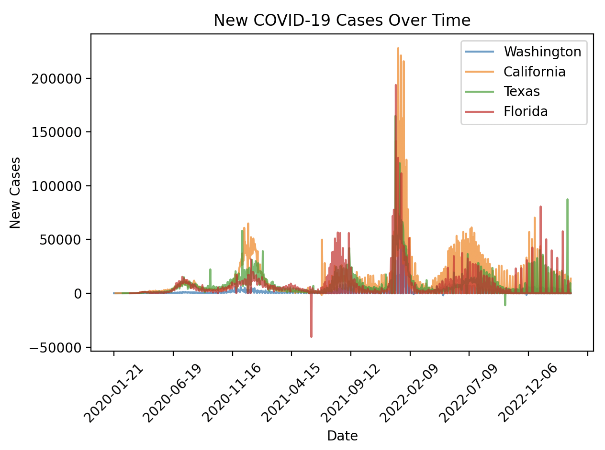
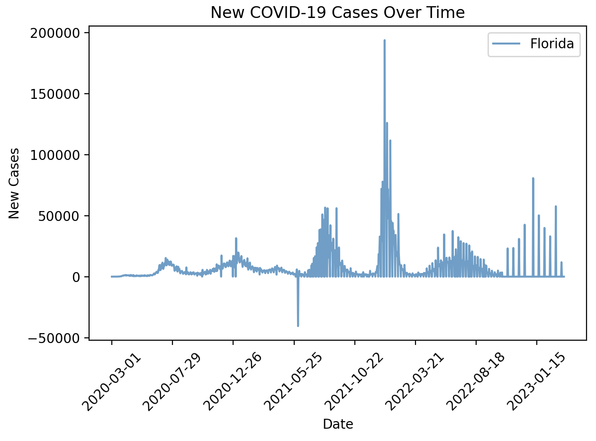
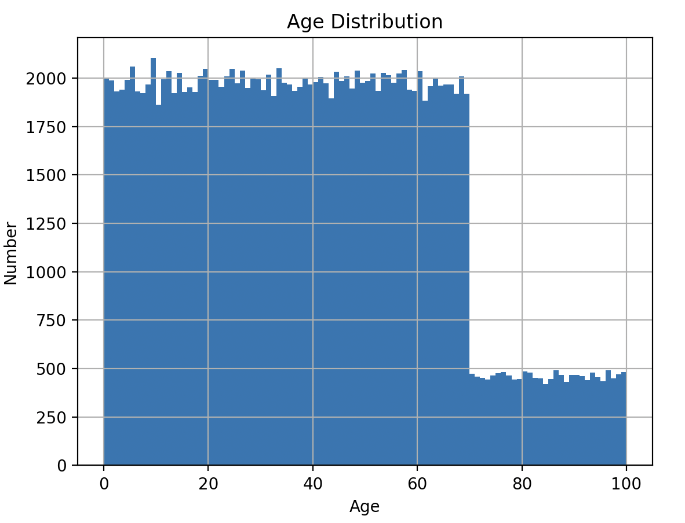
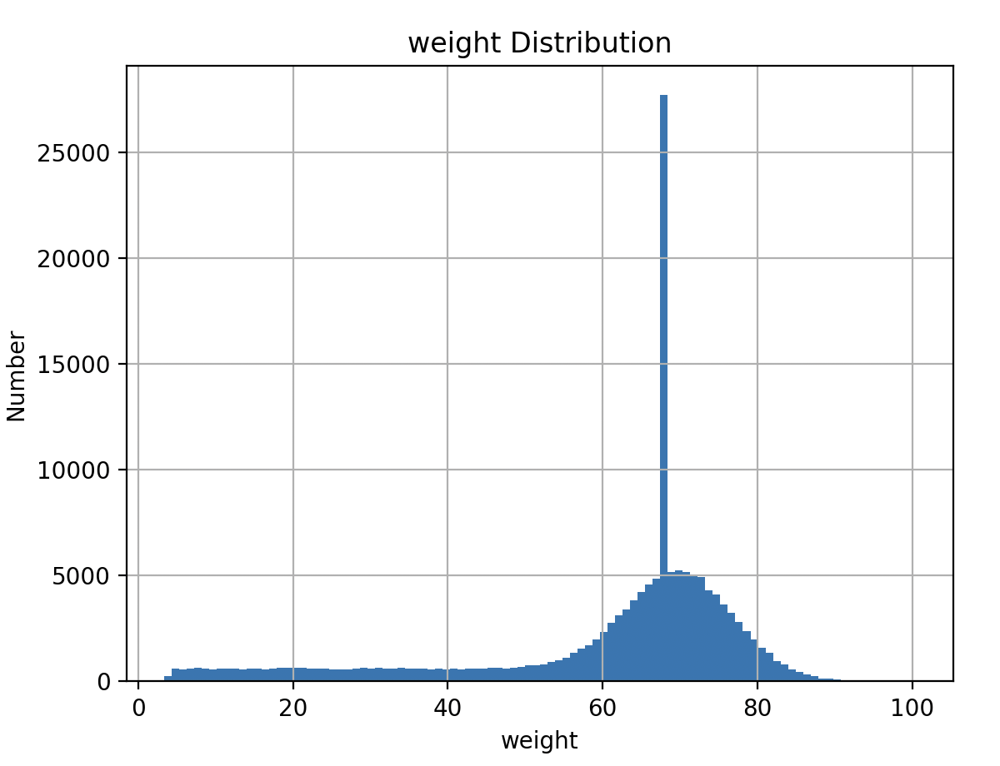
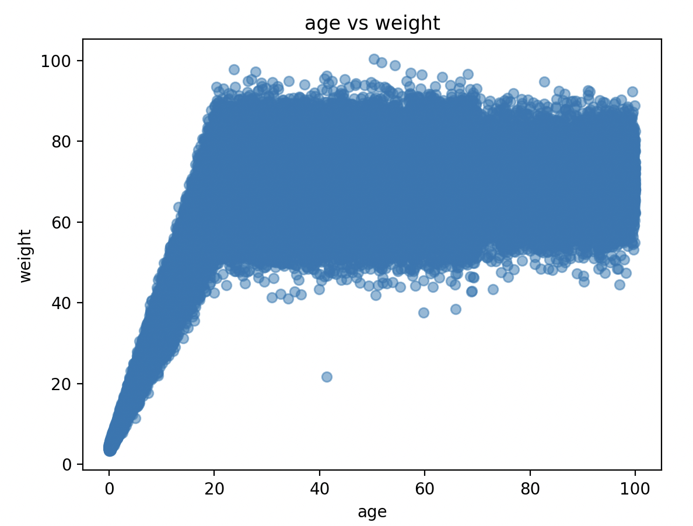

# CBB 6340 - Problem Set 0

### Student Information

Name: Jinnie Sun

NetID: js4872

### Instructions for Running Scripts

This project's scripts are written in Python.

### Exercise Answers & Results

#### Exercise 1: Clinical Decision Support - Temperature Tester

##### 1b. Identify ambiguity in problem description

1. **Temperature unit**: The use of Celcius or Fahrenheit degree is not clarified.
2. **Inclusive/Exclusive range**: Whether should a temperature that is exactly 1 degree away from the normal temperature be considered healthy is not clarified.

##### 1c. Testing

Inputs:

```python
chicken_tester(42)
human_tester(42)
chicken_tester(43)
human_tester(35)
human_tester(98.6)
```

Results:

```
True
False
False
False
False
```

#### Exercise 2: Analyzing COVID-19 Case Data

##### 2a. Data Acquisition and Loading

Data source: The New York Times. (2021). Coronavirus (Covid-19) Data in the United States. Retrieved 08/30/2025, from https://github.com/nytimes/covid-19-data.

##### 2b. Visualization of New Cases

Limitation of my approach:

The difference of cases between adjacent days are calculated here as new cases each day, but the case numbers are not updated everyday in this dataset. Therefore, there are many days with 0 new cases which is not the real circumstance. Shown as below:



##### 2c. Find Peak Case Dates

Commands:

```python
print(peak_case('Washington'))
print(peak_case('California'))
print(peak_case('Texas'))
print(peak_case('Florida'))
```

Results:

```python
2022-01-18
2022-01-10
2022-01-03
2022-01-04
```

which is consistent with the [figure](assets/image-20250830222210497.png) above. 

##### 2e. Examine individual states



```python
             date    state  fips    cases  deaths  new_cases
25213  2021-06-04  Florida    12  2289332   36985   -40527.0
```

At 2021-06-04, there is a significant decrease in cases. 

Hypothesis: It's possible that the negative case count was a result of correcting for duplicate or erroneous entries in the previous case records.

#### Exercise 3: Analyzing Population Data

##### 3a. Load and Examine Data:

What columns are present in the dataset?

+ name
+ age
+ weight
+ eyecolor

How many rows (representing individuals) does the dataset contain?

+ 152361

##### 3b. Analyze Age Distribution

Statistics for the age column:

```python
mean         39.510528
std          24.152760
min           0.000748
max          99.991547
```

Histogram of age distribution:



The role of the number of bins

+ The number of bins determines the number of intervals the data is sorted into. Too few bins can hide important information of data, while too many bins can result in large noises.

Comment on any outliers or patterns you observe in the age distribution.

+ The frequency of individuals decreases sharply after the age of 70.

##### 3c. Analyze Weight Distribution

Statistics for the weight column:

```python
mean         60.884134
std          18.411824
min           3.382084
max         100.435793
```

Histogram of age distribution:



Comment on any outliers or patterns you observe in the age distribution.

+ There is a significant high number of people with a weight of 68.

##### 3d. Explore Relationships



General relationship between weights and ages:

+ Weight increases linearly with age until approximately 22, after which it stabilizes.

Identify and name any individual whose data does not follow the general relationship observed. 

+ Anthony Freeman

  ```python
                  name   age  weight eyecolor
  537  Anthony Freeman  41.3    21.7    green
  ```

Process for identifying this outlier

+ From the scatter plot, it is observed that only this outlier has a weight less than 30 and an age larger than 40.

  ```python
  print(df[(df['weight']<30) & (df['age']>40)])
  ```

#### Exercise 4: Hospital Data Analysis

##### 4a. Data Loading and Basic Analysis

Data source: Goldberger AL, Amaral LAN, Glass L, Hausdorff JM, Ivanov PCh, Mark RG, Mietus JE, Moody GB, Peng C-K, Stanley HE. PhysioBank, PhysioToolkit, and PhysioNet: Components of a New Research Resource for Complex Physiologic Signals. *Circulation* **101**(23):e215-e220 [Circulation Electronic Pages; http://circ.ahajournals.org/content/101/23/e215.full]; 2000 (June 13).

Female is more common than male in `PATIENTS.csv`.

There are 55 entries for female and 45 entries for male.

Inputs:

```python
sum(patients['gender']=='F')
sum(patients['gender']=='M')
```

Results:

```python
55
45
```

##### 4c. Function Testing

The funtion `get_subject_ids` first finds the icd9 code of the given diagnosis, then finds all subject ids with a record of the icd9 code.

The testing function `func_test` finds all the diagnostic records with the found subject ids. Keep the entries with given diagnosis name and check if whether all subject ids still exist. This function ensures all subject ids have a record of the given diagnosis.

Command:

```python
func_test("Intestinal infection due to Clostridium difficile")
```

Results:

```python
# Result of function get_subject_ids.
[10043, 10045, 10094, 10102, 40595, 41976, 44228]

# Found records with both the subject ids and the diagnosis name.
      subject_id icd9_code                short_name                                          long_name
186        10043     00845  Int inf clstrdium dfcile  Intestinal infection due to Clostridium difficile
201        10045     00845  Int inf clstrdium dfcile  Intestinal infection due to Clostridium difficile
436        10094     00845  Int inf clstrdium dfcile  Intestinal infection due to Clostridium difficile
469        10102     00845  Int inf clstrdium dfcile  Intestinal infection due to Clostridium difficile
814        40595     00845  Int inf clstrdium dfcile  Intestinal infection due to Clostridium difficile
1166       41976     00845  Int inf clstrdium dfcile  Intestinal infection due to Clostridium difficile
1753       44228     00845  Int inf clstrdium dfcile  Intestinal infection due to Clostridium difficile

# Testing result
All 7 subject_ids have the diagnosis Intestinal infection due to Clostridium difficile.
```

##### 4d. Age Calculation

Results:

```python
    subject_id        dob        dod  age_days
15       10043 2109-04-07 2191-02-07     29891
17       10045 2061-03-25 2129-12-01     25087
33       10094 1880-02-29 2180-03-20    109593
36       10102 2035-04-13 2105-06-11     25626
59       40595 2068-03-04 2144-10-31     27999
66       41976 2136-07-28 2202-12-05     24235
99       44228 2112-10-22 2171-04-14     21358
```

Findings:

+ There is an outlier subject (id: 10094) with an abnormal calculated age. This is probably resulted from the wrong dob information. 
+ The average age of patients diagnosed with Intestinal infection due to Clostridium difficile is around 25000 days.

##### 4e. Discussion

Compare these alternative structures with table-based data.

+ For dictionary (A), the diagnostic information (e.g. names) appears repetitively in nested dictionaries for different patients. Similarly, for dictionary (B), the patient information appears repetitively in nested dictionaries for different patients.
+ Table-based data can be indexed relatively flexibly, whereas indexing in dictionary structures should follow its hierarchy.

Explain the strengths and weaknesses of these structures for different types of queries and analyses.

+ Using dictionary A makes it easy to query and analyze one subject, and dictionary B makes it easy to query and analyze one diagnosis. However, querying the other item is more complicated for each dictionary.
+ Querying nor analyzing table-based data is neither too complicated, but it usually requires multiple queries across different tables.
+ Table-based data can reduce redundant information, while dictionaries can consume more storage.

Describe in words (no need to implement) how code might transform the data from the tabular form it stated out as into one of these hierarchical formats.

+ Transform tabular data to dictionary (A):

  Merge `D_ICD_DIAGNOSES` and `DIAGNOSES_ICD` by column `icd9_code`, then merge this new table with `PATIENTS` by column `subject_id`. Group the final table by `subject_id`, then convert the grouped object to a dictionary. 

### Appendix: Code

 [exercise1.py](exercise1.py) 

```python
def temp_tester(normal_temp):
    def temp_checker(test_temp):
        temp_diff = abs(normal_temp - test_temp)
        if temp_diff <= 1:
            # Healthy temperature range
            return True
        else:
            return False
    return temp_checker

human_tester = temp_tester(37)
chicken_tester = temp_tester(41.1)

chicken_tester(42) # True -- i.e. not a fever for a chicken
human_tester(42)   # False -- this would be a severe fever for a human
chicken_tester(43) # False
human_tester(35)   # False -- too low
human_tester(98.6) # False -- normal in degrees F but our reference temp was in degrees C
```

 [exercise2.py](exercise2.py) 

```python
import matplotlib.pyplot as plt
from matplotlib.ticker import MaxNLocator
import pandas as pd
data = pd.read_csv("problem_set_0/us-states.csv")

def new_cases(states):
    """
    Takes a list of state names and plots their new cases versus date using overlaid line graphs.
    """
    plt.figure()
    for state in states:
        state_data = data[data['state'] == state]
        state_data = state_data.sort_values('date')
        state_data['new_cases'] = state_data['cases'].diff().fillna(0)
        plt.plot(state_data['date'], state_data['new_cases'], label=state, alpha=0.7)
    plt.xlabel('Date')
    plt.ylabel('New Cases')
    plt.title('New COVID-19 Cases Over Time')
    ax = plt.gca()
    ax.xaxis.set_major_locator(MaxNLocator(nbins=10)) 
    plt.xticks(rotation=45)
    plt.legend()
    plt.tight_layout()
    plt.show()
    # print(state_data[state_data['new_cases'] < 0])

new_cases(['Florida'])

def peak_case(state):
    """
    Takes the name of a state and returns the date of its highest number of new cases.
    """
    state_data = data[data['state'] == state]
    peak_date = state_data.loc[state_data['cases'].diff().idxmax()]['date']
    return peak_date

peak_case('Florida')
```

 [exercise3.py](exercise3.py) 

```python
import pandas as pd
import sqlite3
import matplotlib.pyplot as plt

db_file = 'pset0-population.db'

with sqlite3.connect(db_file) as db:
    df = pd.read_sql_query(f"SELECT * FROM population", db)
    print(df.columns)
    print(df.size)

    def analyze(column, bins):
        print(df[column].describe())
        plt.figure()
        hist = df[column].hist(bins=bins)
        hist.set_title(f'{column} Distribution')
        hist.set_xlabel(column)
        hist.set_ylabel('Number')
        plt.show()

    analyze('age', 100)
    analyze('weight', 100)

    # Explore Relationships
    def scatter(col1, col2):
        plt.figure()
        plt.scatter(df[col1], df[col2], alpha=0.5)
        plt.title(f'{col1} vs {col2}')
        plt.xlabel(col1)
        plt.ylabel(col2)
        plt.show()

    scatter('age', 'weight')

    # Identify the outlier
    print(df[(df['weight']<30) & (df['age']>40)])

```

 [exercise4.py](exercise4.py) 

```python
import pandas as pd

d_icd_diag = pd.read_csv('problem_set_0/D_ICD_DIAGNOSES.csv') # diag & diag_id
diag_icd = pd.read_csv('problem_set_0/DIAGNOSES_ICD.csv') # patient_id & diag_id
patients = pd.read_csv('problem_set_0/PATIENTS.csv') # patient_id & info

## 4a
print(sum(patients['gender']=='F'))
print(sum(patients['gender']=='M'))

## 4b
def get_subject_ids(diagnosis: str) -> list:
    diag_icd9 = d_icd_diag[(d_icd_diag['short_title']==diagnosis)|(d_icd_diag['long_title']==diagnosis)]['icd9_code'].iloc[0]
    sub_ids = diag_icd[diag_icd['icd9_code']==diag_icd9]['subject_id'].to_list()
    print(sub_ids)
    return sub_ids

get_subject_ids("Intestinal infection due to Clostridium difficile")

## 4c Function testing

def func_test(diagnosis: str):
    sub_ids = get_subject_ids(diagnosis)
    # 1. Check if all found subject_ids have the right diagnosis.
    sub_diag = diag_icd[diag_icd['subject_id'].isin(sub_ids)][['subject_id','icd9_code']]
    sub_diag['short_name'] = sub_diag['icd9_code'].map(d_icd_diag.set_index('icd9_code')['short_title'])
    sub_diag['long_name'] = sub_diag['icd9_code'].map(d_icd_diag.set_index('icd9_code')['long_title']) 
    sub_diag = sub_diag[(sub_diag['short_name']==diagnosis)|(sub_diag['long_name']==diagnosis)]
    print(sub_diag)
    for id in sub_ids:
        if id not in sub_diag['subject_id'].to_list():
            print(f"Error: subject_id {id} not found in diag_icd")
            return False
    print(f"All {len(sub_ids)} subject_ids have the diagnosis {diagnosis}.")
    return True

func_test("Intestinal infection due to Clostridium difficile")

## 4d. Age Calculation
def calculate_age(diagnosis: str):
    sub_ids = get_subject_ids(diagnosis)
    subjects = patients[patients['subject_id'].isin(sub_ids)][['subject_id','dob','dod']]
    subjects['dob'] = pd.to_datetime(subjects['dob'])
    subjects['dod'] = pd.to_datetime(subjects['dod'])
    
    # Set dob and dod to_pydatetime() and then calculate age in days
    ages = []
    for i in range(len(subjects)):
        sub = subjects.iloc[i]
        age = sub['dod'].to_pydatetime() - sub['dob'].to_pydatetime()
        ages.append(age.days)
    subjects['age_days'] = ages
    print(subjects)
    return subjects
    
calculate_age("Intestinal infection due to Clostridium difficile")

```

