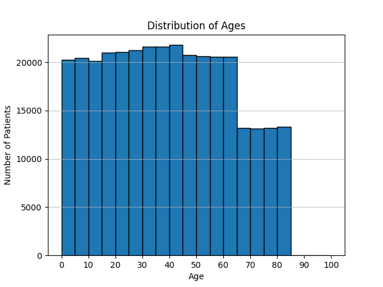

# CBB 6340 - Problem Set 1

### Student Information

Name: Jinnie Sun

NetID: js4872

### Instructions for Running Scripts

This project's scripts are written in Python.

### Exercise Answers & Results

#### Exercise 1: Efficiently search patient data

##### 1a. **Plot Age **Distribution

+ Plot a histogram showing the distribution of ages:



+ No patients share the same exact age, as converting the list of ages to a set does not change the total count.

  Command:

  ```python
  print(len(set(ages)), len(ages))
  ```

  Result:

  ```python
  324357 324357
  ```

+ Explain how the non-existence of multiple patients with the same age affects the solution to the rest of the problem.

  【tbc】

##### 1b. **Plot Age **Distribution