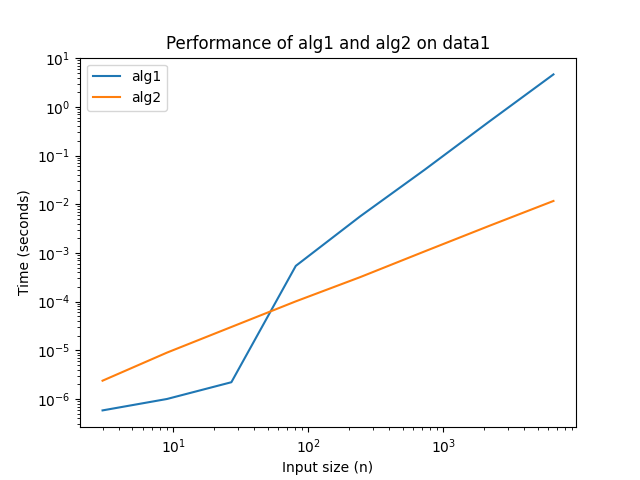
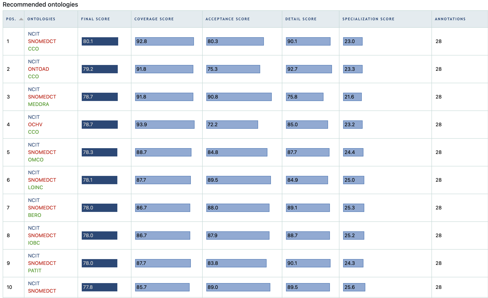

# CBB 6340 - Problem Set 1

### Student Information

Name: Jinnie Sun

NetID: js4872

### Instructions for Running Scripts

This project's scripts are written in Python.

### Exercise Answers & Results

#### Exercise 1: Efficiently search patient data

##### 1a. **Plot Age **Distribution

+ Plot a histogram showing the distribution of ages:


+ No patients share the same exact age, as converting the list of ages to a set does not change the total count.

  Command:

  ```python
  print(len(set(ages)), len(ages))
  ```

  Output:

  ```python
  324357 324357
  ```

+ *Extra Credit:* (2 points) Explain how the existence (or non-existence) of multiple patients with the same age affects the solution to the rest of the problem.

  The non-existence of multiple patients with the same age can prevent the ambiguity in the sorting order. 

  If there exist multiple patients with the same age, the number of patients in certain age range might be wrong. In binary search, when the `mid` lands in the middle of a specific age, the patients before/after the `mid` with the exact age might be ignored unexpectedly. Additionally, the meaning of the 'eldest' and the 'second eldest' becomes ambiguous, as their might be multiple patients with a same eldest age.

##### 1b. Plot Gender Distribution

+ Plot the distribution of genders from the dataset.

  

+ Identify how gender is encoded in the data and list the categories used.

  Gender is encoded by a string. Three categories are used: 'female', 'male', and 'unknown'.

##### 1c. Sort Patients by Age

Eldest patient: Monica Caponera, Age 84.99855742449432, Gender female

##### 1d. Finding the Second Oldest Patient

- Describe a method to find the second oldest patient in O(n) time. Keep in mind sorting the list is O(n log n).

  Pseudo code:

  ```python
  oldest = 0
  second_oldest = 0
  for patient in patients:
  	if patient.age > oldest:
  		second_oldest = oldest
      oldest = patient.age
    elif patient.age > second_oldest:
      second_oldest = patient.age
  ```

- Discuss scenarios where it is advantageous to sort the data versus using the O(n) solution.

  Sorting the data is advantageous when we need to make multiple rank-based queries later. While if we only need one or a few specific queries, such as the largest and the second largest items, the O(n) solution is more efficient. 

##### 1e. Binary Search for Specific Age

```python
# ----- 1e. Binary Search for Specific Age-----
def binary_search(patients, target_age):
    low = 0
    high = len(patients) - 1

    while low <= high:
        mid = (low + high) // 2
        mid_age = float(patients[mid].get('age'))

        if mid_age == target_age:
            return patients[mid]
        elif mid_age < target_age:
            low = mid + 1
        else:
            high = mid - 1

    return None

patient_41d5 = binary_search(patients_sorted_by_age, 41.5)
print(f"Patient aged 41.5: {patient_41d5.get('name')}, Age {patient_41d5.get('age')}, Gender {patient_41d5.get('gender')}")
```

Output:

```python
Patient aged 41.5: John Braswell, Age 41.5, Gender male
```

##### 1f. Count Patients Above a Certain Age

With only small modifications on `binary_search`.

```python
# -----1f. Count Patients Above a Certain Age-----
def count_above_age(patients, target_age):
    count = 0
    low = 0
    high = len(patients) - 1

    while low <= high:
        mid = (low + high) // 2
        mid_age = float(patients[mid].get('age'))

        if mid_age == target_age:
            count += high - mid
            return count
        elif mid_age < target_age:
            low = mid + 1
        else:
            count += high - mid + 1
            high = mid - 1
        
    return count

count_above_41d5 = count_above_age(patients_sorted_by_age, 41.5)
print(f"Number of patients older than 41.5: {count_above_41d5}")
# validate with a linear scan
# print(len([age for age in ages if age > 41.5]))
```

Output:

```python
Number of patients older than 41.5: 150470
```

##### 1g. Function for Age Range Query

```python
# -----1g. Function for Age Range Query-----
def count_in_age_range(patients, low_age, high_age):
    count = 0
    low = 0
    high = len(patients) - 1

    # Find the first patient >= low_age
    while low <= high:
        mid = (low + high) // 2
        mid_age = float(patients[mid].get('age'))

        if mid_age < low_age:
            low = mid + 1
        else:
            high = mid - 1

    start_index = low

    # Find the last patient < high_age
    low = 0
    high = len(patients) - 1
    while low <= high:
        mid = (low + high) // 2
        mid_age = float(patients[mid].get('age'))

        if mid_age < high_age:
            low = mid + 1
        else:
            high = mid - 1

    end_index = high

    if start_index <= end_index:
        count = end_index - start_index + 1

    return count

# validation
print(count_in_age_range(patients_sorted_by_age, 0, 100), len(ages))
print(count_in_age_range(patients_sorted_by_age, 30, 41.5), len([age for age in ages if 30 <= age < 41.5]))
```

Output:

```python
324357 324357
49752 49752
```

##### 1h. Function for Age and Gender Range Query

```python
# -----1h. Function for Age and Gender Range Query-----
def count_male_in_age_range(patients, low_age, high_age):
    # data setup
    patients_male = [p for p in patients if p.get('gender') == 'male']
    
    count = count_in_age_range(patients, low_age, high_age)
    count_male = count_in_age_range(patients_male, low_age, high_age)

    return count, count_male

# validation
print(count_male_in_age_range(patients_sorted_by_age, 0, 100), (len(ages), len([p for p in patients if p.get('gender') == 'male' and 0 <= float(p.get('age')) < 100])))
print(count_male_in_age_range(patients_sorted_by_age, 30, 41.5), (len([age for age in ages if 30 <= age < 41.5]), len([p for p in patients if p.get('gender') == 'male' and 30 <= float(p.get('age')) < 41.5])))
```

Output:

```python
(324357, 158992) (324357, 158992)
(49752, 24869) (49752, 24869)
```

### Exercise 2: Low-level standards and their implications

##### 2a. Understanding the function

+ What does it appear that they are trying to do? What's the relationship between tstop, delta_t, and the number of doses administered?

  They are trying to administer a dose at fixed time intervals until a stopping point is reached. 

  The number of doses administered = ceil( `tstop` / `delta-_t`)

##### 2b. A first test case

```python
Administering meds at t=0
Administering meds at t=0.25
Administering meds at t=0.5
Administering meds at t=0.75
```


##### 2c. A second test case

```python
Administering meds at t=0
Administering meds at t=0.1
Administering meds at t=0.2
Administering meds at t=0.30000000000000004
Administering meds at t=0.4
Administering meds at t=0.5
Administering meds at t=0.6
Administering meds at t=0.7
Administering meds at t=0.7999999999999999
Administering meds at t=0.8999999999999999
Administering meds at t=0.9999999999999999
```

##### 2d. Interpreting the surprises

In the second case, several times are not exactly like expected, e.g. the time of the fourth dose is expected to be 0.3 instead of 0.30000000000000004. The number of doses is also one more than expected. This is due to the storing method of float numbers in python.

##### 2e. Clinical implications

For the value of every time, the change is small in magnitude and the value is close to the true one. However, it causes a significant change in number of doses, which may result in serious medical issues. The error in the number itself is tiny, but looking at the whole, this error can cause the program to make a wrong decision. 

##### 2f. A safer implementation

```python
# -----2f. A safer implementation-----
def administer_meds_rev(delta_t, tstop):
    num = int(tstop / delta_t)
    t = 0
    for _ in range(num): 
        print(f"Administering meds at t={t:.4f}")
        t += delta_t

administer_meds_rev(0.1, 1)
```

Output:

```python
Administering meds at t=0.0000
Administering meds at t=0.1000
Administering meds at t=0.2000
Administering meds at t=0.3000
Administering meds at t=0.4000
Administering meds at t=0.5000
Administering meds at t=0.6000
Administering meds at t=0.7000
Administering meds at t=0.8000
Administering meds at t=0.9000
```

The revised function calculates the number of doses first, ensuring its correctness. The output is also formatted to four decimal places, in this case making the numbers true to the expected values.

### Exercise 3: Algorithm Analysis and Performance Measurement

##### 3a. Hypothesize the Operation

Test cases:

```python
# -----3a. Hypothesize the Operation-----
n = 5
print(data1(n),alg1(data1(n)))
print(data2(n),alg1(data2(n)))
print(data3(n),alg1(data3(n)))
print(random.sample(range(n), n),alg1(random.sample(range(n), n)))
print(random.sample(range(n), n),alg2(random.sample(range(n), n)))
```

Output:

```python
[31.0, 31.026, 31.07515666666667, 31.1456131764, 31.236317170692352] [31.0, 31.026, 31.07515666666667, 31.1456131764, 31.236317170692352]
[0, 1, 2, 3, 4] [0, 1, 2, 3, 4]
[5, 4, 3, 2, 1] [1, 2, 3, 4, 5]
[4, 0, 3, 1, 2] [0, 1, 2, 3, 4]
[2, 1, 4, 0, 3] [0, 1, 2, 3, 4]
```

Hypothesis: `alg1` and `alg2` sort a list of numbers in ascending order. 

##### 3b. Explain the algorithms

`alg1`

+ Go through every pair of adjacent items in the list, swap the two items if the former is larger than the latter. Repeat the process until there is no swap in a single iteration. Then the sorting is completed. 

`alg2`

+ Split a list in the middle into two sublists. Sort each sublist through the same method. Merge the two sorted sublists by iteratively taking the smaller of the top (smallest) items of two sublists. 

##### 3c. Performance Measurement and Analysis



Big-O for each algorithm 

+ `alg1`

  $O(n^2)$

  In the worst case, all pairs would be compared once, which is ${n(n-1)\over2}$ times. 

+ `alg2`

  $O(n\log n)$

  There would be $\log n$ divisions, for each of which the merging cost at most $n$. 


##### 3d. Conclusions and recommendations

+ Discuss how the performance scales across the three data sets.

  The performance of `alg2` is remarkably consistent across three datasets, while that of `alg1` is sensitive to datasets. `alg1` demonstrates best performance on `data2`, average performance on `data1`, and worst on `data3`. 

+ Recommend which algorithm would be preferable for different types of data and justify your recommendation based on your findings. (2 points)

  If we priorly know the data is sorted, `alg1` is a good option to check the order, with a lowest time cost of $O(n)$. Otherwise, when we do not have a confident knowledge about the order, `alg2` is better with its consistently good performance. For `alg1`, the existence of only one unsorted item at the end of a list can result in a huge increase in time cost ($O(n)$ to $O(n^2)$). While the performance of `alg2` is  independent from the data  with an efficient time complexity of $O(n\log n)$.

### Exercise 4: Implementing and Analyzing a Binary Search Tree as a tool for organizing data

##### 4a. & 4b.

```python
class Tree:
    def __init__(self):
        self._value = None
        self._data = None
        self.left = None
        self.right = None
    def add(self,value, data):
        if self._value is None:
            self._value = value
            self._data = data
        elif value < self._value:
            if self.left is None:
                self.left = Tree()
            self.left.add(value, data)
        else:
            if self.right is None:
                self.right = Tree()
            self.right.add(value, data)

    def __contains__(self, patient_id):
        if self._value == patient_id:
            return True
        elif self.left and patient_id < self._value:
            return patient_id in self.left
        elif self.right and patient_id > self._value:
            return patient_id in self.right
        else:
            return False
```

Test:

```python
my_tree = Tree()
for patient_id, initials in [(24601, "JV"), (42, "DA"), (7, "JB"), (143, "FR"), (8675309, "JNY")]:
    my_tree.add(patient_id, initials)

print(24601 in my_tree)
print(1492 in my_tree)
```

Output:

```python
True
False
```

##### 4c. Implement and Test a `has_data` Method

```python
def has_data(self, data):
        if self._data == data:
            return True
        elif self.left and self.left.has_data(data):
            return True
        elif self.right and self.right.has_data(data):
            return True
        else:
            return False
```

Test:

```python
print(my_tree.has_data("JV"))
print(my_tree.has_data(24601))
```

Output:

```python
True
False
```

##### 4d. Performance Analysis of `__contains__` and `has_data`

+ Timing two methods:

  7 different numbers of nodes are used to plot each timing:

  

  The graph shows that the time required for checking if a number is in the tree approaches $O(\log N)$ as $n$ increases.

   `__contains__` is faster than `has_data`. It is because the tree is sorted by IDs (`self._value`), and more branches of the tree can be skipped while using `__contains__` to search for an ID. Whereas in `has_data`, every node should be looked into until the right one is found. 

+ Setup time analysis

  

##### 4e. Discussing Choice of Test Data

+ Explain why it is unrepresentative to always use a specific value (e.g., patient_id = 1) as test data or to only use one test point for performance analysis. Discuss the implications of choosing appropriate test data for accurately assessing performance.

  The performance of a searching algorithm can be highly dependent on the location of the chosen test data. If the specific node is very close to (or very far away from) the root of the tree, we will underestimate (or overestimate) the time cost of a tree searching algorithm if we only choose the specific value for testing. We need multiple test data to see the average performance of an algorithm.

  Therefore, we should pick multiple random test data for a more accurate assessment.

#### Exercise 5: Choosing ontologies for clinical research data

##### 5a. Recommended ontology set

Ontologies

1. National Cancer Institute Thesaurus (NCIT)

   Data types: Gene sequences, medications, notes.

   NCIT is a massive and comprehensive biomedical ontology. While its primary focus is on cancer, it has evolved into a broad, comprehensive ontology covering thousands of concepts related to diseases, drugs, anatomy, genes, proteins, and biological processes.

2. Systematized Nomenclature of Medicine -- Clinical Terms (SNOMED CT)

   Data types: Imaging, medications, notes.

   SNOMED CT covers the vast landscape of general medicine, from symptoms and diagnoses to procedures and findings. It can link a diagnosis in a clinical note, a procedure, a medication, and an imaging finding under a single, unified coding system.

##### 5b. Licensing and alternatives

1. NCIT

   The NCI Thesaurus™ is released under the Creative Commons Attribution 4.0 International license (CC BY 4.0). (https://evs.nci.nih.gov/ftp1/NCI_Thesaurus/ThesaurusTermsofUse.htm)

   This license grants broad freedoms to use the material for almost any purpose, including commercially. Users must give appropriate credit to the creator.

2. SNOMED CT

   SNOMED CT is a proprietary terminology. If you are using and/or deploying SNOMED CT in a non-Member country/territory, you are required to apply for a license on an annual basis. (https://www.snomed.org/licensing)

   Use is free within member countries (like the United States, UK, Canada, Australia, etc.) for their healthcare systems. However, using it in a non-member country can cost significant fees. 

   An **alternative** is LOINC, which is 'made available at no cost worldwide under the license at http://loinc.org/license.' 

   **Why it's acceptable:** LOINC provides a set of universal names and ID codes for identifying laboratory and clinical test results. It provides exceptional coverage and specificity for coding lab tests, vital signs, and measurements, which constitute a huge portion of a patient's record.

   **Why SNOMED CT is still better:** SNOMED CT's scope is broader, while LOINC is more specialized in lab results. SNOMED CT is more suitable in this context.

   **Discovery/Maintenance Tradeoffs:** SNOMED CT's licensing model funds a dedicated international organization to ensure high-quality, consistent updates, tools and support. The tradeoff for the maintenance is the access restriction. 

##### 5c. Search methodology and stopping rule

I list some example keywords regarding gene sequences, imaging, medications, and notes respectively. Then choose 'keywords' as input, 'ontology sets' as output, and submit the text to the BioPortal Ontology Recommender:


The result shows that the combination of two ontologies, NCIT and SNOMED CT, provides high scores for both coverage and detail. While certain three-ontology sets achieved higher scores, the performance difference was not significant. Therefore, the pairing of NCIT and SNOMED CT offers a comprehensive and non-redundant framework without introducing unnecessary complexity.



### Appendix: Code

 [ex1.py](ex1.py) 

```python
import matplotlib.pyplot as plt
from xml.etree import ElementTree as ET

file = 'problem_set_1/data/pset1-patients.xml'
patients_et = ET.parse(file)
patients = patients_et.getroot().find('patients').findall('patient')

# -----1a. Plot Age Distribution-----
ages = []
for patient in patients:
    age = patient.get('age')
    ages.append(float(age))

plt.figure()
plt.hist(ages, bins=range(0, 101, 5), edgecolor='black')
plt.title('Distribution of Ages')
plt.xlabel('Age')
plt.ylabel('Number of Patients')
plt.xticks(range(0, 101, 10))
plt.grid(axis='y', alpha=0.75)
plt.savefig('problem_set_1/figures/age_distribution.png')
# plt.show()

# Determine if any patients share the same exact age.
print(len(set(ages)), len(ages))

# -----1b. Plot Gender Distribution-----
genders = {}
for patient in patients:
    gender = patient.get('gender')
    # print(gender)
    if gender not in genders.keys():
        genders[gender] = 0
    genders[gender] += 1
gender_labels = list(genders.keys())
count_values = list(genders.values())
plt.figure()
plt.bar(gender_labels, count_values)
plt.title('Distribution of Genders')
plt.xlabel('Gender')
plt.ylabel('Number of Patients')
plt.savefig('problem_set_1/figures/gender_distribution.png')
# plt.show()

# -----1c. Sort Patients by Age-----
patients_sorted_by_age = sorted(patients, key=lambda x: float(x.get('age')))
eldest = patients_sorted_by_age[-1]
print(f"Eldest patient: {eldest.get('name')}, Age {eldest.get('age')}, Gender {eldest.get('gender')}")

# ----- 1e. Binary Search for Specific Age-----
def binary_search(patients, target_age):
    low = 0
    high = len(patients) - 1

    while low <= high:
        mid = (low + high) // 2
        mid_age = float(patients[mid].get('age'))

        if mid_age == target_age:
            return patients[mid]
        elif mid_age < target_age:
            low = mid + 1
        else:
            high = mid - 1

    return None

patient_41d5 = binary_search(patients_sorted_by_age, 41.5)
print(f"Patient aged 41.5: {patient_41d5.get('name')}, Age {patient_41d5.get('age')}, Gender {patient_41d5.get('gender')}")

# -----1f. Count Patients Above a Certain Age-----
def count_above_age(patients, target_age):
    count = 0
    low = 0
    high = len(patients) - 1

    while low <= high:
        mid = (low + high) // 2
        mid_age = float(patients[mid].get('age'))

        if mid_age == target_age:
            count += high - mid
            return count
        elif mid_age < target_age:
            low = mid + 1
        else:
            count += high - mid + 1
            high = mid - 1
        
    return count

count_above_41d5 = count_above_age(patients_sorted_by_age, 41.5)
print(f"Number of patients older than 41.5: {count_above_41d5}")
# validate with a linear scan
print(len([age for age in ages if age > 41.5]))

# -----1g. Function for Age Range Query-----
def count_in_age_range(patients, low_age, high_age):
    count = 0
    low = 0
    high = len(patients) - 1

    # Find the first patient >= low_age
    while low <= high:
        mid = (low + high) // 2
        mid_age = float(patients[mid].get('age'))

        if mid_age < low_age:
            low = mid + 1
        else:
            high = mid - 1

    start_index = low

    # Find the last patient < high_age
    low = 0
    high = len(patients) - 1
    while low <= high:
        mid = (low + high) // 2
        mid_age = float(patients[mid].get('age'))

        if mid_age < high_age:
            low = mid + 1
        else:
            high = mid - 1

    end_index = high

    if start_index <= end_index:
        count = end_index - start_index + 1

    return count

# validation
print(count_in_age_range(patients_sorted_by_age, 0, 100), len(ages))
print(count_in_age_range(patients_sorted_by_age, 30, 41.5), len([age for age in ages if 30 <= age < 41.5]))

# -----1h. Function for Age and Gender Range Query-----
def count_male_in_age_range(patients, low_age, high_age):
    # data setup
    patients_male = [p for p in patients if p.get('gender') == 'male']
    
    count = count_in_age_range(patients, low_age, high_age)
    count_male = count_in_age_range(patients_male, low_age, high_age)

    return count, count_male

# validation
print(count_male_in_age_range(patients_sorted_by_age, 0, 100), (len(ages), len([p for p in patients if p.get('gender') == 'male' and 0 <= float(p.get('age')) < 100])))
print(count_male_in_age_range(patients_sorted_by_age, 30, 41.5), (len([age for age in ages if 30 <= age < 41.5]), len([p for p in patients if p.get('gender') == 'male' and 30 <= float(p.get('age')) < 41.5])))
```

 [ex2.py](ex2.py) 

```python
def administer_meds(delta_t, tstop):
    t = 0
    while t < tstop: 
        print(f"Administering meds at t={t}")
        t += delta_t

# -----2b. A first test case-----
administer_meds(0.25, 1)

# -----2c. A second test case-----
administer_meds(0.1, 1)

# -----2f. A safer implementation-----
def administer_meds_rev(delta_t, tstop):
    num = int(tstop / delta_t)
    t = 0
    for _ in range(num): 
        print(f"Administering meds at t={t:.4f}")
        t += delta_t

administer_meds_rev(0.1, 1)
```

 [ex3.py](ex3.py) 

```python
import random
import time
import matplotlib.pyplot as plt

def alg1(data):
  data = list(data)
  changes = True
  while changes:
    changes = False
    for i in range(len(data) - 1):
      if data[i + 1] < data[i]:
        data[i], data[i + 1] = data[i + 1], data[i]
        changes = True
  return data

def alg2(data):
  if len(data) <= 1:
    return data
  else:
    split = len(data) // 2
    left = iter(alg2(data[:split]))
    right = iter(alg2(data[split:]))
    result = []
    # note: this takes the top items off the left and right piles
    left_top = next(left)
    right_top = next(right)
    while True:
      if left_top < right_top:
        result.append(left_top)
        try:
          left_top = next(left)
        except StopIteration:
          # nothing remains on the left; add the right + return
          return result + [right_top] + list(right)
      else:
        result.append(right_top)
        try:
          right_top = next(right)
        except StopIteration:
          # nothing remains on the right; add the left + return
          return result + [left_top] + list(left)
        
def data1(n, sigma=10, rho=28, beta=8/3, dt=0.01, x=1, y=1, z=1):
    import numpy
    state = numpy.array([x, y, z], dtype=float)
    result = []
    for _ in range(n):
        x, y, z = state
        state += dt * numpy.array([
            sigma * (y - x),
            x * (rho - z) - y,
            x * y - beta * z
        ])
        result.append(float(state[0] + 30))
    return result

def data2(n):
    return list(range(n))

def data3(n):
    return list(range(n, 0, -1))

# -----3a. Hypothesize the Operation-----
n = 5
print(data1(n),alg1(data1(n)))
print(data2(n),alg1(data2(n)))
print(data3(n),alg1(data3(n)))
print(random.sample(range(n), n),alg1(random.sample(range(n), n)))
print(random.sample(range(n), n),alg2(random.sample(range(n), n)))

# -----3c. Performance Measurement and Analysis-----
def time_cal(data, alg):
    shortest = float('inf')
    for _ in range(5):
        start = time.perf_counter()
        alg(data)
        end = time.perf_counter()
        if end - start < shortest:
            shortest = end - start
    return shortest

nn = 8
n = [3**i for i in range(1, nn + 1)]
alg1_times = [time_cal(data1(i), alg1) for i in n]
alg2_times = [time_cal(data1(i), alg2) for i in n]

# log-log plot
plt.figure()
plt.loglog(n, alg1_times, label='alg1')
plt.loglog(n, alg2_times, label='alg2')
plt.xlabel('Input size (n)')
plt.ylabel('Time (seconds)')
plt.title('Performance of alg1 and alg2 on data1')
plt.legend()
# plt.show()
plt.savefig('problem_set_1/figures/alg_performance.png')

# data2
alg1_times = [time_cal(data2(i), alg1) for i in n]
alg2_times = [time_cal(data2(i), alg2) for i in n]

# log-log plot for data2
plt.figure()
plt.loglog(n, alg1_times, label='alg1')
plt.loglog(n, alg2_times, label='alg2')
plt.xlabel('Input size (n)')
plt.ylabel('Time (seconds)')
plt.title('Performance of alg1 and alg2 on data2')
plt.legend()
# plt.show()
plt.savefig('problem_set_1/figures/alg_performance_data2.png')

# data3
alg1_times = [time_cal(data3(i), alg1) for i in n]
alg2_times = [time_cal(data3(i), alg2) for i in n]  
# log-log plot for data3
plt.figure()
plt.loglog(n, alg1_times, label='alg1')
plt.loglog(n, alg2_times, label='alg2')
plt.xlabel('Input size (n)')
plt.ylabel('Time (seconds)')    
plt.title('Performance of alg1 and alg2 on data3')
plt.legend()
# plt.show()
plt.savefig('problem_set_1/figures/alg_performance_data3.png')
```

 [ex4.py](ex4.py) 

```python
import numpy as np
import time
import matplotlib.pyplot as plt

class Tree:
    def __init__(self):
        self._value = None
        self._data = None
        self.left = None
        self.right = None
    def add(self,value, data):
        if self._value is None:
            self._value = value
            self._data = data
        elif value < self._value:
            if self.left is None:
                self.left = Tree()
            self.left.add(value, data)
        else:
            if self.right is None:
                self.right = Tree()
            self.right.add(value, data)

    def __contains__(self, patient_id):
        if self._value == patient_id:
            return True
        elif self.left and patient_id < self._value:
            return patient_id in self.left
        elif self.right and patient_id > self._value:
            return patient_id in self.right
        else:
            return False
    def has_data(self, data):
        if self._data == data:
            return True
        elif self.left and self.left.has_data(data):
            return True
        elif self.right and self.right.has_data(data):
            return True
        else:
            return False
        

# -----4a. Implement the add Method-----
my_tree = Tree()
for patient_id, initials in [(24601, "JV"), (42, "DA"), (7, "JB"), 
                             (143, "FR"), (8675309, "JNY")]:
    my_tree.add(patient_id, initials)
print(my_tree.left._value)

# -----4b. Implement a __contains__ Method-----
print(24601 in my_tree)
print(1492 in my_tree)

# -----4c. Implement and Test a has_data Method-----
print(my_tree.has_data("JV"))
print(my_tree.has_data(24601))

# -----4d. Performance Analysis of __contains__ and has_data-----
n_values = np.logspace(1, 4, num=7, dtype=int)
contains_times = []
has_data_times = []
for n in n_values:
    my_tree = Tree()
    for patient_id in np.random.permutation(n):
        my_tree.add(patient_id, f"Patient {patient_id}")
    
    # Time __contains__ method
    shortest_contains_time = float('inf')
    for _ in range(5):
        start_time = time.perf_counter()
        for patient_id in range(n):
            _ = patient_id in my_tree
        cur_contain_time = time.perf_counter() - start_time
        if cur_contain_time < shortest_contains_time:
            shortest_contains_time = cur_contain_time
    contains_times.append(shortest_contains_time/n)
    
    # Time has_data method
    shortest_hasdata_time = float('inf')
    for _ in range(5):
        start_time = time.perf_counter()
        for patient_id in range(n):
            _ = my_tree.has_data(f"Patient {patient_id}")
        cur_hasdata_time = time.perf_counter() - start_time
        if cur_hasdata_time < shortest_hasdata_time:
            shortest_hasdata_time = cur_hasdata_time
    has_data_times.append(shortest_hasdata_time/n)

# Reference line for O(log n)
C = contains_times[0] / np.log(n_values[0])
log_ref_times = C * np.log(n_values)

plt.figure()
plt.loglog(n_values, contains_times, label='contains')
plt.loglog(n_values, has_data_times, label='has_data')
plt.loglog(n_values, log_ref_times, '--', label='O(log N) reference')
plt.xlabel('Number of nodes in tree')
plt.ylabel('Time (seconds)')
plt.legend()
plt.grid(True, which="both", ls="--")
plt.title('Performance of __contains__ vs has_data')
# plt.show()
plt.savefig('problem_set_1/figures/tree_performance.png')

# Set-up analysis
setup_times = []
for n in n_values:
    shortest_setup_time = float('inf')
    for _ in range(5): 
        start_time = time.perf_counter()
        my_tree = Tree()
        for patient_id in np.random.permutation(n):
            my_tree.add(patient_id, f"Patient {patient_id}")
        cur_setup_time = time.perf_counter() - start_time
        if cur_setup_time < shortest_setup_time:
            shortest_setup_time = cur_setup_time
    setup_times.append(shortest_setup_time)

# Reference line for O(n)
C_setup = setup_times[0] / n_values[0]
linear_ref_times = C_setup * n_values
# Reference line for O(n^2)
quadratic_ref_times = C_setup * (n_values**2) / n_values[0]

plt.figure()
plt.loglog(n_values, setup_times, label='setup')
plt.loglog(n_values, linear_ref_times, '--', label='O(N) reference')
plt.loglog(n_values, quadratic_ref_times, ':', label='O(N^2) reference')
plt.xlabel('Number of nodes in tree')
plt.ylabel('Time (seconds)')
plt.legend()
plt.grid(True, which="both", ls="--")
plt.title('Performance of Tree Setup')
# plt.show()
plt.savefig('problem_set_1/figures/tree_setup_performance.png')
```

