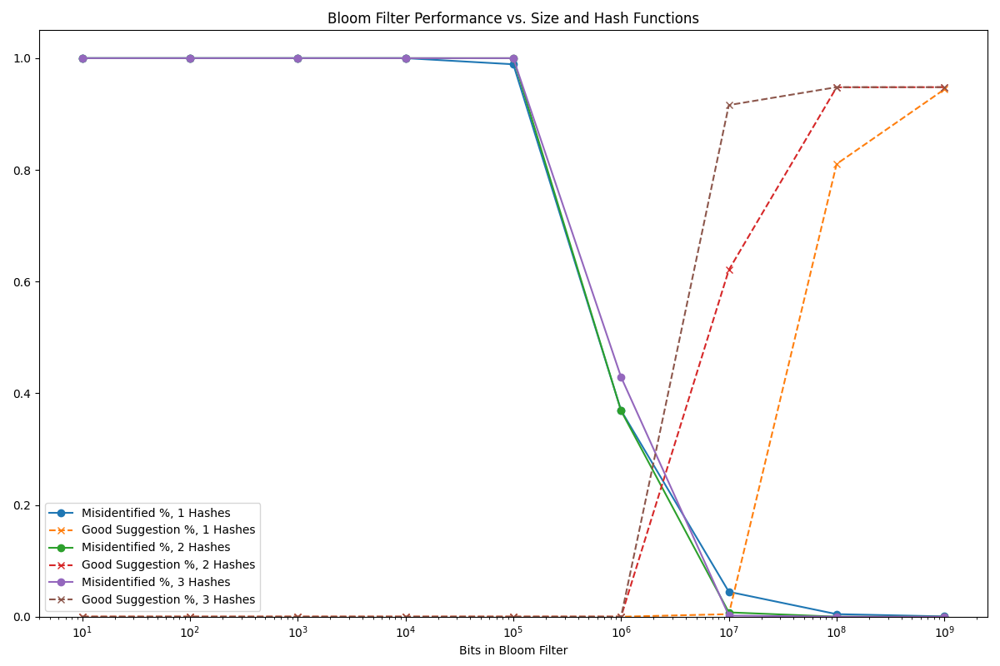
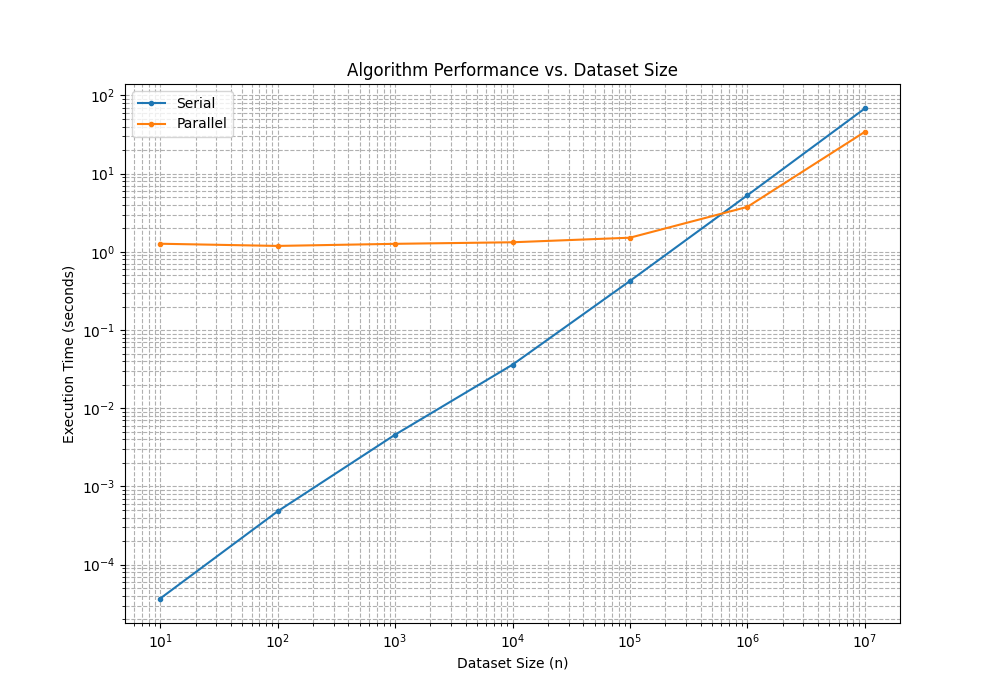
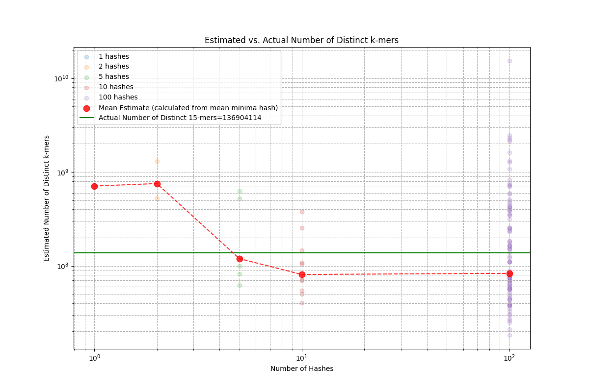
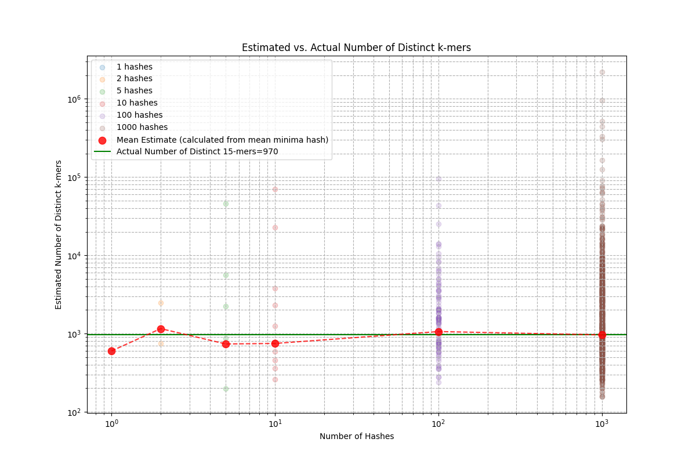

# CBB 6340 - Problem Set 2

### Student Information

Name: Jinnie Sun

NetID: js4872

### Instructions for Running Scripts

This project's scripts are written in Python.

### Exercise Answers & Results

#### Exercise 1: Spelling Correction Using a Bloom Filter

##### 1a. Implementing and Populate a Bloom Filter

+ Create a Bloom Filter

  ```python
  class BloomFilter:
      def __init__(self, size, hash_functions):
          self.size = size
          self.hash_functions = hash_functions
          # Initialize all bits to 0 (False).
          self.bit_array = bitarray(size)
          self.bit_array.setall(0)
  
      def add(self, item):
          for h_func in self.hash_functions:
              index = h_func(item, self.size)
              self.bit_array[index] = 1
  
      def __contains__(self, item):
          # If all bits were 1, the item is probably in the set.
          for h_func in self.hash_functions:
              index = h_func(item, self.size)
              if not self.bit_array[index]:
                  return False
          return True
  ```

+ Insert Words into the Bloom Filter

  ```python
  FILTER_SIZE = int(1e7)
  HASH_FUNCTIONS = [my_hash, my_hash2, my_hash3]
  bloom_filter = BloomFilter(FILTER_SIZE, HASH_FUNCTIONS)
  word_set = set()
  word_count = 0
  with open('words.txt') as f:
      for line in f:
          word = line.strip()
          if word:
              bloom_filter.add(word)
              word_set.add(word)
              word_count += 1
  print(f"Added {word_count} words to the Bloom filter.")
  ```

  Output

  ```python
  Added 466550 words to the Bloom filter.
  ```

##### 1b. Spell Check and Correction

+ Implement a Spelling Correction Function

  ```python
  def spelling_correction(word, bloom_filter):
      alphabet = 'abcdefghijklmnopqrstuvwxyz'
      suggestions = []
  
      # Check for single character edits
      for i in range(len(word)):
          for c in alphabet:
              candidate = word[:i] + c + word[i+1:]
              if candidate in bloom_filter:
                  suggestions.append(candidate)
  
      return suggestions
  # test
  # print(spelling_correction('floeer', bloom_filter))
  ```

  Validated with self-check examples.

+ Evaluate Performance

  ```python
  def evaluation(bloom_filter, typos):
      good_suggestions = 0
      false_positives = 0
      total_typo = 0
  
      for [typed_word, correct_word] in typos:
          # Spell check
          if typed_word == correct_word:
              continue
          # Spell correction
          total_typo += 1
          suggestions = spelling_correction(typed_word, 
                                            bloom_filter)
          if len(suggestions)<=3 and 
          		correct_word in suggestions:
              good_suggestions += 1
          if typed_word in bloom_filter:
              false_positives += 1
              
      return good_suggestions, total_typo, false_positives
    
  with open('typos.json', 'r') as file:
      typos = json.load(file)
  good_suggestions, total_typo, false_positives = evaluation(bloom_filter, typos)
  
  print(f"Ratio of 'good' suggestions: {good_suggestions}/{total_typo}={good_suggestions/total_typo:.4f}")
  ```

  Output:

  ```python
  Ratio of 'good' suggestions: 22900/25000=0.9160
  ```

##### 1c. Analysis and Reflection

+ Plot the Effect of Filter Size and Number of Hash Functions

  

+ Approximately how many bits are necessary to achieve 85% good suggestions with each combination of 1, 2, or 3 hash functions?

  3 hash function: 5e6

  2 hash functions: 3e7

  1 hash functions: 1e8

#### Exercise 2: Accelerating data processing with parallel programming

##### 2a. Modify alg2 for Keyed Sorting

I use a list of integers `address=list(range(len(data)))` to track the sorting process. The ith number in `address` represents the index of the item in the original list of data that corresponds to the ith item in `keys`. `address` always has the same length as `keys`, and transposes exactly as `keys`. 

After (`alg2_dict`) taking the argument of the data dictionary and the specified key to sort by, only the two lists of numbers (`keys` and `address`) are involved in the actual sorting algorithm (`alg2`), instead of the whole data. 

```python
import random
random.seed(0)

def alg2(keys, address):
    if len(keys) <= 1:
        return keys, address
    else:
        split = len(keys) // 2
        left, left_address = alg2(keys[:split],address[:split])
        right, right_address = alg2(keys[split:],address[split:])
        left = iter(left)
        right = iter(right)
        left_address = iter(left_address)
        right_address = iter(right_address)
        result = []
        result_address = []
        # note: this takes the top items off the left and right piles
        left_top = next(left)
        right_top = next(right)
        left_addr_top = next(left_address)
        right_addr_top = next(right_address)
        while True:
            if left_top < right_top:
                result.append(left_top)
                result_address.append(left_addr_top)
                try:
                    left_top = next(left)
                    left_addr_top = next(left_address)
                except StopIteration:
                    # nothing remains on the left; add the right + return
                    return result + [right_top] + list(right), 
                  result_address + [right_addr_top] + list(right_address)
            else:
                result.append(right_top)
                result_address.append(right_addr_top)
                try:
                    right_top = next(right)
                    right_addr_top = next(right_address)
                except StopIteration:
                    # nothing remains on the right; add the left + return
                    return result + [left_top] + list(left), 
                  result_address + [left_addr_top] + list(left_address)
                
def alg2_dict(data, key):
    print(f'Original {key}s: {[d[key] for d in data]}')
    keys = [d[key] for d in data]
    addr = list(range(len(data)))
    keys_sorted, addr_sorted = alg2(keys, addr)
    print(f'Sorted {key}s: {keys_sorted}')
    return [data[i] for i in addr_sorted]
```

Testing examples:

+ `patient_id`, `patient_data,` and `age` are generated for each item.

  Randomly generated `patient_id` and `age` have been used as the specified key respectively. 

  ```python
  n = 5
  data = [{'patient_id': i, 'patient_data': chr(97 + i), 'age': random.randint(1, 99)} for i in random.sample(range(n), k=n)]
  
  print("Unsorted data:")
  print(data)
  print("\nSort by patient_id:")
  print(alg2_dict(data, 'patient_id'))
  print("\nSort by age:")
  print(alg2_dict(data, 'age'))
  ```

  Output

  ```python
  Unsorted data:
  [{'patient_id': 3, 'patient_data': 'd', 'age': 52}, {'patient_id': 4, 'patient_data': 'e', 'age': 39}, {'patient_id': 0, 'patient_data': 'a', 'age': 62}, {'patient_id': 1, 'patient_data': 'b', 'age': 46}, {'patient_id': 2, 'patient_data': 'c', 'age': 75}]
  
  Sort by patient_id:
  Original patient_ids: [3, 4, 0, 1, 2]
  Sorted patient_ids: [0, 1, 2, 3, 4]
  [{'patient_id': 0, 'patient_data': 'a', 'age': 62}, {'patient_id': 1, 'patient_data': 'b', 'age': 46}, {'patient_id': 2, 'patient_data': 'c', 'age': 75}, {'patient_id': 3, 'patient_data': 'd', 'age': 52}, {'patient_id': 4, 'patient_data': 'e', 'age': 39}]
  
  Sort by age:
  Original ages: [52, 39, 62, 46, 75]
  Sorted ages: [39, 46, 52, 62, 75]
  [{'patient_id': 4, 'patient_data': 'e', 'age': 39}, {'patient_id': 1, 'patient_data': 'b', 'age': 46}, {'patient_id': 3, 'patient_data': 'd', 'age': 52}, {'patient_id': 0, 'patient_data': 'a', 'age': 62}, {'patient_id': 2, 'patient_data': 'c', 'age': 75}]
  
  ```

  The result shows that the algorithm works well with both keys. The sorting result is correct, and the data are aligned well. 

##### 2b. Parallelize the Algorithm

In the parallel method, the list of data is equally divided into `num_cores` chunks. 

```python
def merge_sorted_lists(list1, list2, key):
    merged = []
    i, j = 0, 0
    while i < len(list1) and j < len(list2):
        if list1[i][key] < list2[j][key]:
            merged.append(list1[i])
            i += 1
        else:
            merged.append(list2[j])
            j += 1
    merged.extend(list1[i:])
    merged.extend(list2[j:])
    return merged

def alg2_dict_chunked(data, key, pool, num_chunks):
    chunk_size = len(data) // num_chunks
    tasks = []
    
    for i in range(num_chunks):
        chunk = data[i*chunk_size : (i+1)*chunk_size] 
        				if i < num_chunks - 1 else data[i*chunk_size :]
        tasks.append(pool.apply_async(alg2_dict, (chunk, key)))
    sorted_chunks = [task.get() for task in tasks]

    # Merge sorted chunks
    while len(sorted_chunks) > 1:
        merged_chunks = []
        for i in range(0, len(sorted_chunks), 2):
            if i + 1 < len(sorted_chunks):
                merged_chunks.append(merge_sorted_lists(
                  sorted_chunks[i], sorted_chunks[i + 1], key))
            else:
                merged_chunks.append(sorted_chunks[i])
        sorted_chunks = merged_chunks

    return sorted_chunks[0]
  
if __name__ == "__main__":
  ...
  with multiprocessing.Pool(processes=num_cores) as pool:
      alg2_dict_chunked(data, 'patient_id', pool, num_cores)
  ...
```

Result:



The time complexity of the parallel method is relatively lower as the dataset size increases. 

When `n=1e7` and `num_cores=8` :

```python
Elapsed time (parallel): 34.259061000077054 seconds
Elapsed time (serial): 68.18649779097177 seconds
```

It is quite promising that this parallel algorithm can reach 2x speedup with more cores and larger datasets. 

*Every execution time in the result is the shortest of 5 repeated runs. 

#### Exercise 3: Estimating the Number of Distinct 15-mers in Chromosome 1 using Hash Functions

##### 3a. Parsing and k-mer generation

Write code to parse the FASTA file and extract all overlapping 15-mers from chromosome 1. 

+ ```python
  # -----3a. Parsing and k-mer generation-----
  with open("problem_set_2/data/human_g1k_v37.fasta", "r") as handle:
      for record in SeqIO.parse(handle, "fasta"):
          sequence_chr1 = record.seq
          break
  
  sequence_chr1 = str(sequence_chr1)
  len_seq = len(sequence_chr1)
  kmer_set = set()
  k = 15
  
  # Add all kmers to a set
  cur_kmer = sequence_chr1[:k]
  kmer_set.add(cur_kmer)
  for i in tqdm(range(k, len_seq), desc='Adding kmers...'):
      cur_kmer = cur_kmer[1:] + sequence_chr1[i]
      kmer_set.add(cur_kmer)
  
  # Exclude any 15-mer that contains more than two Ns
  kmer2discard = []
  for kmer in tqdm(kmer_set, desc='Cleaning kmers...'):
      if kmer.count('N') > 2:
          kmer2discard.append(kmer)
  print(f'{len(kmer2discard)} kmers discarded.')
  for kmer in kmer2discard:
      kmer_set.discard(kmer)
  
  print(f'Length of Chromosome 1: {len_seq}')
  print(f'Number of valid 15-mers: {len(kmer_set)}')
  ```

+ How many nucleotides are in Chromosome 1?

  ```python
  >>> print(f'Length of Chromosome 1: {len_seq}')
  Length of Chromosome 1: 249250621
  ```

+ Count how many valid 15-mers you generate (i.e., those that aren't excluded). 

  ```python
  >>> print(f'Number of valid 15-mers: {len(kmer_set)}')
  Number of valid 15-mers: 136904114
  ```

##### 3b. Implementing a hash family

```python
def hash_func(a, encoded_sequence, k):
    hash = 0
    num_N = encoded_sequence[:k].count(5)
    min_hash = M
    for i in range(k):
        hash = (hash * a + encoded_sequence[i]) % M
    if num_N <= 2:
        min_hash = hash
    a_pow = pow(a, k-1, M)
    for i in range(len(encoded_sequence)-k):
        next_digit = encoded_sequence[i+k]
        first_digit = encoded_sequence[i]
        
        term_to_remove = (a_pow * first_digit) % M
        hash = ((hash - term_to_remove + M) * a + next_digit) % M
        if next_digit == 5:
            num_N += 1
        if first_digit == 5:
            num_N -= 1
        if num_N > 2:
            continue
        
        min_hash = min(min_hash, hash)
    return min_hash / M
```

##### 3c. Estimating distinct counts

```python
num_a_list = [1, 2, 5, 10, 100]
min_hash_list = []
a_min = int((M/6)**(1/14))
a_min += (a_min+1)%2

for num_a in tqdm(num_a_list, desc='Estimating distinct kmers...'):
    a_list = [random.randrange(a_min, M, 2) for _ in range(num_a)]    
    sum_hash = 0
    cur_min_hash = []
    # for a in a_list:
    #     cur_min_hash.append(hash_func(a, encoded_sequence, k))
    
    # Use parallel processing to speed up
    cur_min_hash = Parallel(n_jobs=-1)(
    delayed(hash_func)(a, encoded_sequence, k) for a in a_list)
    
    min_hash_list.append(cur_min_hash)
    
for i, num_a in tqdm(enumerate(num_a_list), desc='Plotting...'):
    # Scatter plot for all hash values
    a_vals = [num_a] * len(min_hash_list[i])
    est_vals = [1/h - 1 for h in min_hash_list[i]]
    plt.scatter(a_vals, est_vals, alpha=0.2, label=f'{num_a} hashes')
    
    # Calculate and store mean
    if est_vals:
        mean_est = 1/(sum(min_hash_list[i]) / len(est_vals)) - 1
        mean_est_nums.append(mean_est)
```

##### 3d. Evaluation and analysis

+ Plot the estimated distinct count against the true number of distinct 15-mers for varying numbers of hash functions.

  

  *Another trial on a shorter sequence with more hash functions:

  

+ Discuss how the estimate improves as more hash functions are combined.

  The estimate approaches the actual number of kmers as more hash functions are combined. 

+ How stable are the estimates? What happens if you only use a single hash?

  The estimates are more stable (with smaller sampling variance) as the number of hash functions gets larger. 

  If only a single hash is used, the results of different trials vary a lot and are usually not close to the actual value. 

##### 3e. Justification of design choices

+ How you selected values for $a$:

  1. $a$ should be an odd integer less than $M$. 

  2. $a$ should be large enough so that the hash values can cover the whole array of size $M$. Otherwise, the normalized hash values (by dividing by $M$) would be overall small, and the estimated number of distinct kmers would be larger than the actual number. 

     Therefore, $5(a^{14}+a^{13}+...+a+1)>2e{61}-1$.

     Safely, take $6a^{14}>2e{61}-1$. 

     $a$ should be larger than `((2e61-1)/6)**(1/14)`.

     (Though this criterion does not matter a lot when $M$ and/or the number hash functions is large is large.)

+ Any optimizations you made (e.g., rolling updates, pre-encoding).

  1. Rolling updates

     ```python
     for i in range(len(encoded_sequence)-k):
         next_digit = encoded_sequence[i+k]
         first_digit = encoded_sequence[i]
     
         term_to_remove = (a_pow * first_digit) % M
         hash = ((hash - term_to_remove + M) * a + next_digit) % M
     ```

     The time complexity of every hash update is $O(1)$.

  2. Removal of head and tail 'N's

     ```python
     # Remove leading and trailing Ns, and keep up to 2 Ns at each end
     head_N_num = tail_N_num = 0
     for i in range(len(sequence_chr1)):
         if sequence_chr1[i] == 'N':
             head_N_num += 1
         else:
             break
     for i in range(len(sequence_chr1)-1, 0, -1):
         if sequence_chr1[i] == 'N':
             tail_N_num += 1
         else:
             break
     sequence_chr1 = sequence_chr1[head_N_num-2:len(sequence_chr1)-tail_N_num+2]
     print(f'Head Ns: {head_N_num}, Tail Ns: {tail_N_num}')
     ```

     In this case, 10000 'N's at the beginning and 10000 'N's at the end of the sequence are removed before hashing. The goal is to speed up the algorithm.

  3. Pre-encoding

     ```python
     c = {'A':1, 'C':2, 'G':3, 'T':4, 'N':5}
     encoded_sequence = [c.get(char, 5) for char in sequence_chr1]
     ```

     The sequence is pre-processed into a list of integers before hashing.

  4. Parallel processing

     ```python
     # for a in a_list:
     #     cur_min_hash.append(hash_func(a, encoded_sequence, k))
         
     # Use parallel processing to speed up
     cur_min_hash = Parallel(n_jobs=-1)(
     delayed(hash_func)(a, encoded_sequence, k) for a in a_list)
     ```

     During hashing with different `a`s, `Parallel` package is used for parallel processing, which significantly shortens the execution time.

#### Exercise 4: Thinking about health and the Internet

##### 4A: Research and Analysis

A central part of health informatics involves moving health resources online to enhance efficiency, data collection, and patient access. This digital transformation also comes with some major challenges that we have to take seriously, including bridging the digital divide to ensure equitable access, validating the clinical efficacy of telehealth interventions, and combating the threat of medical misinformation.

**The digital divide.** Not everyone seeks professional medical help when they are having health issues, and even fewer use online healthcare resources.. A study on the socioeconomic demographics of U.S. patients during the COVID-19 pandemic surge shows that vulnerable populations -- including older adults, those with lower household incomes, and the uninsured -- were less likely to engage with telehealth or virtual visits [^1]. This digital divide is even more pronounced in low- and middle-income countries, where many essential resources are inaccessible [^2]. This creates a significant imbalance, as large populations with potentially great medical needs are left without access to care, which is a complex problem that touches upon many societal issues. 

**Efficacy of online healthcare** is another major concern. For instance, a study in Brazil found **no** significant changes in the diabetic patients' HbA1c levels after four months of telehealth intervention[^3]. The convenience of the internet is meaningless if it doesn't bring actual health benefits to patients. Therefore, people have to prioritize and rigorously evaluate the efficacy of any digital health resource, especially when it is intended to replace the traditional care. 

**Misinformation.** As more digital health care approaches appear, people turn to the internet for medical advice. However, a significant portion of the information they find is uncertified and misleading. The proportion of health-related misinformation on social media ranged from 0.2% to 28.8%[^4]. Misleading health content can be extremely dangerous, as it can lead people to delay proven medical care, ingest harmful substances, or develop 'cyberchondri'. Regulations are needed for health-related content on social media and in search engine results. Some platforms have already begun adding warning labels to potentially misleading content, which is a positive step. Further efforts should be made to help people distinguish between reliable and unreliable health information. Credible information should be amplified, as online platforms could also be a useful tool to combat misinformation during crises.

Moving healthcare online creates as many challenges as it solves. The field of health informatics can't just focus on building new tools. It must also solve these complex real-world problems, aiming to deliver better health care to everyone. 

[^1]: Darrat I, Tam S, Boulis M, Williams AM. Socioeconomic Disparities in Patient Use of Telehealth During the Coronavirus Disease 2019 Surge. *JAMA Otolaryngol Head Neck Surg.* 2021;147(3):287–295. doi:10.1001/jamaoto.2020.5161
[^2]: Tiwari, Biplav Babu, Aneesh Kulkarni, Hui Zhang, Mahmud M. Khan, and Donglan Stacy Zhang. 2023. “Utilization of Telehealth Services in Low- and Middle-Income Countries amid the COVID-19 Pandemic: A Narrative Summary.” *Global Health Action* 16 (1). doi:10.1080/16549716.2023.2179163.
[^3]: Franco, Debora Wilke, Janine Alessi, Taíse Rosa de Carvalho, Gabriel Luiz Kobe, Giovana Berger Oliveira, Carolina Padilla Knijnik, Bibiana Amaral*, et al.* "The Impact of a Telehealth Intervention on the Metabolic Profile of Diabetes Mellitus Patients During the Covid-19 Pandemic - a Randomized Clinical Trial." *Primary Care Diabetes* 16, no. 6 (2022/12/01/ 2022): 745-52. https://doi.org/https://doi.org/10.1016/j.pcd.2022.09.011
[^4]: Borges do Nascimento IJ, Pizarro AB, Almeida JM, Azzopardi-Muscat N, Gonçalves MA, Björklund M, Novillo-Ortiz D. Infodemics and health misinformation: a systematic review of reviews. Bull World Health Organ. 2022 Sep 1;100(9):544-561. doi: 10.2471/BLT.21.287654.

##### 4B: Personal Connection

My experience with a commercial smartwatch points a challenge in digital health: the gap between consumer-grade data and clinical reliability. The device, which advertised sleep, heart rate, and blood oxygen tracking, consistently misidentified my sleep. It usually recorded me as asleep when I was lying awake late at night or early in the morning. It also registered my awake time incorrectly, often marking it from the moment I touched the screen rather than when I actually woke up. This reflects a common limitation of devices not relying on the clinical “gold standard” of diagnosis, which uses EEG and EMG signals.

This inaccuracy quickly eroded my trust in the device's output, a crucial barrier to the adoption of digital health tools. However, a subtle benefit might be that the device prompted me to pay more attention to my sleep habits. If wearables developers can further guide users to make manual corrections and emphasize the personalization of the algorithm, it would help bridge the accuracy gap and transform these devices into more genuine health partners.

##### 4C: Meta-Reflection

I don't have a lot of experience with telehealth and telemedicine, because in my home country it is convenient and popular for most people to see a doctor in person. Therefore, a challenging part for me is to understand more about the telehealth system and how people are using it. This made it difficult to fully grasp the concerns of users -- such as issues with trust, security, and convenience -- and then to form a truly genuine point of view. It reinforced for me that researchers in this field must have plenty of real-world experience to effectively address the needs of the people they hope to help.

#### Exercise 5: Discover data

