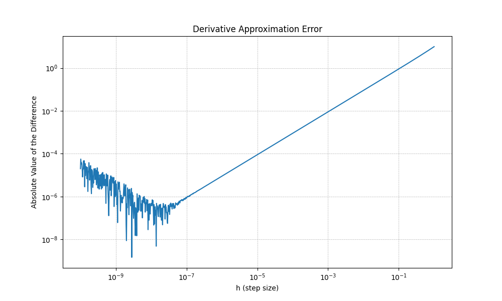

# CBB 6340 - Problem Set 3

### Student Information

Name: Jinnie Sun

NetID: js4872

### Instructions for Running Scripts

This project's scripts are written in Python.

### Exercise Answers & Results

#### Exercise 1: Retrieving PubMed Data via Entrez API (25 points)

##### 1a. Retrieve PubMed IDs for Alzheimer’s and Cancer Papers

```python
def get_pubmed_id_lists(term):
    r = requests.get(
        "https://eutils.ncbi.nlm.nih.gov/entrez/eutils/"
        f"esearch.fcgi?db=pubmed&term={term}&retmode=xml&retmax=1000"
    )
    doc = m.parseString(r.text)
    id_lists = doc.getElementsByTagName("Id")
    id_list = [id_node.childNodes[0].wholeText for id_node in id_lists]
    return id_list
  
if __name__ == "__main__":
    # 1a. Retrieve PubMed id_lists for Alzheimer’s and Cancer Papers
    terms = ['Alzheimers+AND+2024[pdat]', 'cancer+AND+2024[pdat]']
    id_lists = {}
    for term in terms:
        id_lists[term.split('+')[0]] = get_pubmed_id_lists(term)
```

##### 1b. Retrieve Metadata for the Papers

```python
def get_pubmed_metadata(query, id_list):
    output_filename = f"problem_set_3/metadata_{query}.json"
    # if os.path.exists(output_filename):
    #     return
    id_list_str = ",".join(id_list)
    url = "https://eutils.ncbi.nlm.nih.gov/entrez/eutils/efetch.fcgi"
    parameters = {
        "db": "pubmed",
        "id": id_list_str,
        "retmode": "xml"
    }
    r = requests.post(url, data=parameters)

    root = ET.fromstring(r.text)
    metadata_dict = {}

    for article in root.findall(".//PubmedArticle"):
        pmid_element = article.find(".//PMID")
        pmid = pmid_element.text

        title_element = article.find(".//ArticleTitle")
        title_text = ""
        if title_element is not None:
            title_text = ET.tostring(title_element, method="text", encoding="unicode").strip()

        abstract_element = article.find(".//AbstractText")
        abstract_text = ""
        if abstract_element is not None:
            abstract_text = ET.tostring(abstract_element, method="text", encoding="unicode").strip()

        metadata_dict[pmid] = {
            "ArticleTitle": title_text,
            "AbstractText": abstract_text,
            "query": query 
        }

    with open(output_filename, "w") as f:
        json.dump(metadata_dict, f, indent=4)
    print(f"Metadata for {query} saved to {output_filename}") 
    return metadata_dict
    
if __name__ == "__main__":
		# 1b. Retrieve Metadata for the Papers
    for query, id_list in id_lists.items():
        get_pubmed_metadata(query, id_list)
```

I noticed that though 1000 ids were retrieved by esearch for each query, only 999 articles were found by the efetch in the case of 'cancer'. This one pubmed id might be retracted or suppressed for some reason.

Head of `metadata_Alzheimers.json`:

```json
{
    "41058862": {
        "ArticleTitle": "Deep learning assessment of disproportionately enlarged subarachnoid-space hydrocephalus in Hakim's disease or idiopathic normal pressure hydrocephalus.",
        "AbstractText": "Disproportionately enlarged subarachnoid-space hydrocephalus (DESH) is a key feature of Hakim's disease (synonymous with idiopathic normal pressure hydrocephalus; iNPH). However, it previously had been only subjectively evaluated.",
        "query": "Alzheimers"
    },
    "41024939": {
    ...
```

Head of `metadata_cancer.json`:

```json
{
    "41134009": {
        "ArticleTitle": "Light in the darkness - accessibility to palliative care for cancer patients of Chinese background and their families.",
        "AbstractText": "Palliative care addresses the comprehensive needs of advanced-stage cancer patients, enhancing their quality of life. However, due to cultural and linguistic differences, Chinese Australians encounter substantial barriers to accessing these services.",
        "query": "cancer"
    },
    "41111483": {
      ...
```

##### 1c. Analyze Overlap Between the Two Paper Sets

```python
# 1c. Analyze Overlap Between the Two Paper Sets
overlap = set(id_lists['Alzheimers']).intersection(set(id_lists['cancer']))
print(f"Overlap between Alzheimer's and Cancer papers: {len(overlap)}")

# Print the titles of the overlapped papers
for pmid in overlap:
    with open("problem_set_3/metadata_Alzheimers.json", "r") as f:
        alz_metadata = json.load(f)
    title = alz_metadata[pmid]["ArticleTitle"]
    print(f"PMID: {pmid}, Title: {title}")
```

Output:

```
Overlap between Alzheimer's and Cancer papers: 4
PMID: 40949928, Title: MedGraphNet: Leveraging Multi-Relational Graph Neural Networks and Text Knowledge for Biomedical Predictions.
PMID: 40326981, Title: Exosomes in neurodegenerative diseases: Therapeutic potential and modification methods.
PMID: 40800467, Title: Tractography from T1-weighted MRI: Empirically exploring the clinical viability of streamline propagation without diffusion MRI.
PMID: 40395755, Title: Tau-targeting nanoparticles for treatment of Alzheimer's disease.
```

##### 1d. Handle Structured Abstracts

All `<AbstractText>` parts within the parent `<Abstract>` tag are found. Then labels like 'METHODS' are prepended. Finally all sections are concatenated with spaces.

Tested with the example PMID:20966393 ([metadata_test.json](metadata_test.json)). The results of 'Alzheimers' and 'cancer' were also updated.

```python
# 1d. Handle Structured Abstracts
abstract_parent = article.find(".//Abstract")
abstract_text = ""

if abstract_parent is not None:
    parts = []
    for part in abstract_parent.findall(".//AbstractText"):
        part_text = ET.tostring(part, method="text", encoding="unicode").strip()
        if 'Label' in part.attrib:
            parts.append(f"{part.attrib['Label']}: {part_text}")
        else:
            parts.append(part_text)

    abstract_text = " ".join(parts)
```

Limitation: It's assumed that the structure is defined by the `Label` attribute. If an abstract is formatted without this attribute, this code would not capture the section titles. 

#### Exercise 2: SPECTER Embeddings and Principal Component Analysis (25 points)

Load the papers dictionary (**3 points**) and then process your dictionary of papers to find the SPECTER embeddings (**2 points**). 

```python
def get_abstract(paper):
    return paper['AbstractText']

json_files = ['metadata_Alzheimers.json', 'metadata_cancer.json']
papers = {}
for file in json_files:
    with open(file, 'r', encoding='utf-8') as f:
        cur_papers = json.load(f)
        papers.update(cur_papers)

embeddings = {}
for pmid, paper in tqdm.tqdm(papers.items()):
    data = [paper["ArticleTitle"] + tokenizer.sep_token + get_abstract(paper)]
    inputs = tokenizer(
        data, padding=True, truncation=True, return_tensors="pt", max_length=512
    )
    result = model(**inputs)
    # take the first token in the batch as the embedding
    embeddings[pmid] = result.last_hidden_state[:, 0, :].detach().numpy()[0]

# turn our dictionary into a list
embeddings = [embeddings[pmid] for pmid in papers.keys()]
```

Apply principal component analysis (PCA) to identify the first three principal components. (**5 points**)

+ Here I also hardcoded the `query` for overlapped papers.

```python
from sklearn import decomposition
import pandas as pd

pca = decomposition.PCA(n_components=3)
embeddings_pca = pd.DataFrame(
    pca.fit_transform(embeddings),
    columns=['PC0', 'PC1', 'PC2']
)
# embeddings_pca["query"] = [paper["query"] for paper in papers.values()]
embeddings_pca_query = []
for id, paper in papers.items():
    if id in ['40949928', '40326981', '40800467', '40395755']:
        embeddings_pca_query.append('Overlap')
    else:
        embeddings_pca_query.append(paper["query"])
embeddings_pca['query'] = embeddings_pca_query
```

Plot 2D scatter plots for PC0 vs PC1, PC0 vs PC2, and PC1 vs PC2; color code these by the search query used (Alzheimers vs cancer). (**5 points**)


Comment on the separation or lack thereof, and any take-aways from that. (**5 points**)

+ The scatter plots for PC0 vs. PC1 and PC0 vs. PC2 show a clear, obvious separation between the two groups. In contrast, the PC1 vs. PC2 plot shows significant overlap. Therefore, PC0 alone probably accounts for the majority of the variance.
+ The `cancer` papers are more widely distributed, possibily because cancer is a more more heterogeneous and diverse research domain.
+ The overlap papers are more closely with the Alzheimer's group.

#### Exercise 3: Computer math vs calculus (15 points)

Plot on a log-log graph the difference:

```python
import numpy as np
import matplotlib.pyplot as plt

f = lambda x: x**3
x0 = 3
true_derivative = 3 * x0**2
h_values = np.logspace(-10, 0, num=1000)
numerical_approx = (f(x0 + h_values) - f(x0)) / h_values
difference = np.abs(numerical_approx - true_derivative)

plt.figure(figsize=(10, 6))
plt.loglog(h_values, difference)
plt.xlabel("h (step size)")
plt.ylabel("Absolute Value of the Difference")
plt.title("Derivative Approximation Error")
plt.grid(True, which="both", linestyle='--', linewidth=0.5)
plt.savefig("problem_set_3/derivative_error.png")
```



Describe what happens as gets smaller and smaller (**3 points)**. 

+ When h is smaller than $10^{-7}$, the line becomes noisy and starts to go back up. 

Offer a hypothesis as to why you see the results that you see. **(4 points)**

+ Due to the limited floating-point precision, $f(h+3)$ becomes very close to $f(3)$ and the difference between them cannot be stored accurately. This inaccurate difference is then divided by a tiny $h$, which magnifies the error. 

#### Exercise 4: Health and disease. (25 points)

Write a Python function that uses the Explicit Euler method to plot

+ ```python
  def dS(beta, S, I, N):
      return -beta * S * I / N
  def dI(beta, S, I, N, gamma):
      return beta * S * I / N - gamma * I
  def dR(gamma, I):
      return gamma * I
  
  def simulate_sir(S0, I0, R0, beta, gamma, N, T_max):
      S, I, R = S0, I0, R0
      S_list, I_list, R_list = [S], [I], [R]
      for t in range(T_max):
          dS_dt = dS(beta, S, I, N)
          dI_dt = dI(beta, S, I, N, gamma)
          dR_dt = dR(gamma, I)
  
          S += dS_dt
          I += dI_dt
          R += dR_dt
  
          S_list.append(S)
          I_list.append(I)
          R_list.append(R)
  
      return S_list, I_list, R_list
    
  def plot_sir(I_list, T_max, filename):
      plt.plot(range(T_max + 1), I_list, label='Infected')
      plt.xlabel('Time')
      plt.ylabel('Population')
      plt.legend()
      plt.savefig(filename)
  
  if __name__ == "__main__":
      N = 137000
      I0 = 1
      R0 = 0
      S0 = N - I0 - R0
      beta = 2
      gamma = 1
      T_max = 100
  
      S_list, I_list, R_list = simulate_sir(S0, I0, R0, beta, gamma, N, T_max)
      plot_sir(I_list, T_max, 'problem_set_3/sir_simulation_1.png')
  ```


Plot the time course of the number of infected individuals until that number drops below 1 (at which point, we'll assume the disease has run its course). (**5 points**)

+ Updated `simulate_sir`:

  ```python
  def simulate_sir(S0, I0, R0, beta, gamma, N, T_max, auto_stop=False):
      ...
      for t in range(T_max):
  				...
  				if auto_stop and I < 1:
              T_max = t + 1
              break
      return S_list, I_list, R_list, T_max
  ```

+ Result

  

  

For those parameter values, when does the number of infected people peak? (**2 points**) How many people are infected at the peak? (**3 points**).

+ Updated `simulate_sir`:

  ```python
  def simulate_sir(S0, I0, R0, beta, gamma, N, T_max, auto_stop=False):
      ...
      I_peak = I0
      I_peak_time = 0
      for t in range(T_max):
        	...
          if I > I_peak:
              I_peak = I
              I_peak_time = t + 1
      print(f"Peak Infected: {I_peak} at time {I_peak_time}")
      ...
  ```

+ Result

  ```
  Peak Infected: 26533.15263086103 at time 16
  ```

Vary these two variables over "nearby" values, and plot on a heat map how the time of the peak of the infection depends on these two variables. (**5 points**). Do the same for the number of individuals infected at peak. (**5 points**)

+ Heatmap of peak times

+ Heatmap of peak number of infected individuals 

  

#### Exercise 5
