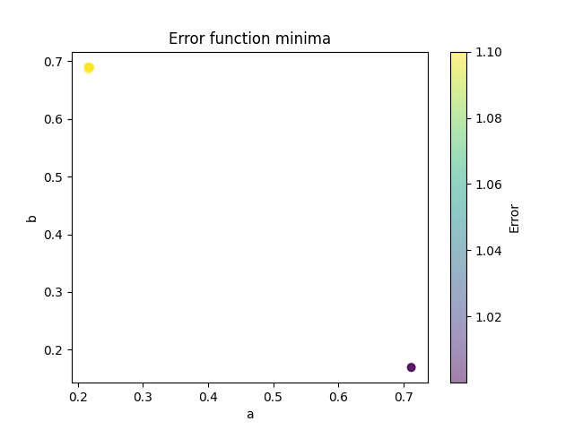
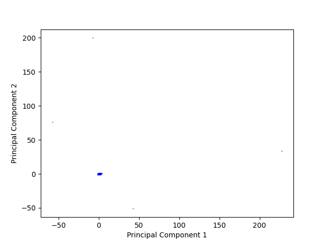
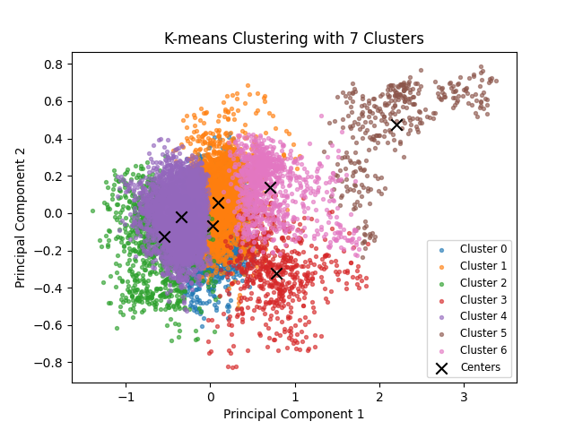
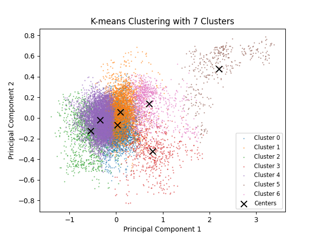
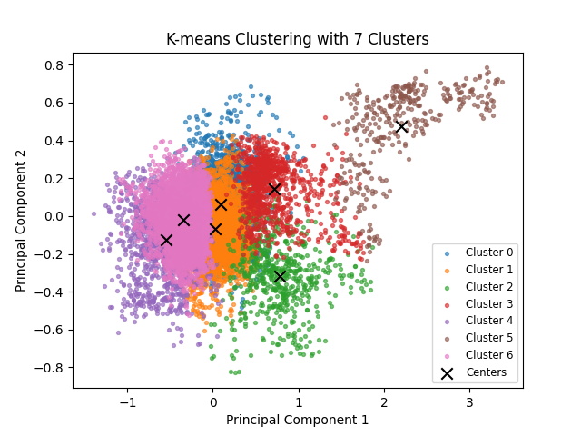
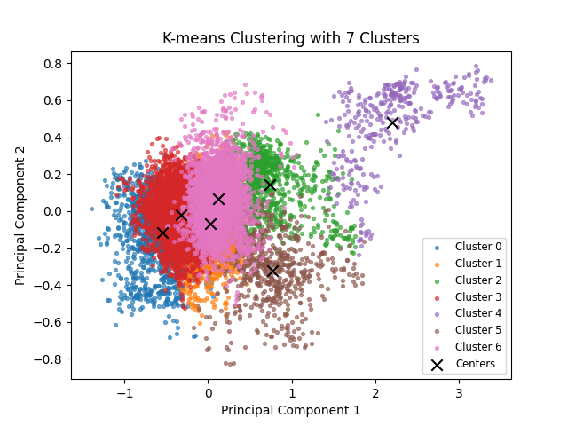

# CBB 6340 - Problem Set 4

### Student Information

Name: Jinnie Sun

NetID: js4872

### Exercise Answers & Results

#### Exercise 1: Gradient Descent for Neural Network Parameter Optimization (25 points)

Is this API access point a [Clean URL](https://en.wikipedia.org/wiki/Clean_URL)? Why or why not? (**1 point**)

+ No.
+ It includes the file path, script name and query parameters.

Implement a two-dimensional version of the gradient descent algorithm to find optimal choices of a and b. (**6 points**)

+ ```python
  ite = 100
  epsilon = 1e-9
  lr = 0.4
  decay = 0.9
  init_ite = 10
  minima = []
  
  for j in range(init_ite):
      a = random.uniform(0,1)
      b = random.uniform(0,1)
      lr = 0.4
      last_err = float('inf')
      for i in range(ite):
          cur_err = err(a, b)
          print(f"Iteration {i}: a = {a}, b = {b}, error = {cur_err}")
          da = (err(a + epsilon, b) - cur_err)/epsilon
          db = (err(a, b + epsilon) - cur_err)/epsilon
          a = min(a - lr * da, 1-2*epsilon)
          b = max(b - lr * db, 2*epsilon)
  
          if abs(last_err - cur_err) < epsilon:
              break
          last_err = cur_err
          lr *= decay
  ```

Explain how you estimate the gradient given that you cannot directly compute the derivative (**3 points**), identify any numerical choices -- including but not limited to stopping criteria -- you made (**3 points**), and justify why you think they were reasonable choices (**3 points**).

+ Gradient estimation: Forward difference method is used to estimate the partial gradient for a and b separately, with `epsilon=1e-16`, which is small enough to provide a close approximation. 
+ Learning: with a learning rate of `0.4`, which allows fast convergence in this case, and a decay rate of `0.9`, which enables it to approach the minima closer. Also it's ensured that `a` and `b` are within the valid range.
+ Stopping criteria: It stops when reaching a maximum number of iterations or when the error values do not change very much. This ensures that the function will terminate and save time if it's not making improvements.

Find both locations (i.e. a, b values) querying the API as needed (**5 points**) and identify which corresponds to which (**2 points**). Briefly discuss how you would have tested for local vs global minima if you had not known how many minima there were. (**2 points**)

+ local minimum: a=0.22, b=0.69

  global minimum: a=0.71, b=0.17

+ I tried different (in this case 10) initial conditions of a and b, ran the gradient descent separately, and then compared their error values: 

  

  The one with lowest error value would be considered the global minimum.


### Exercise 2: Sequence Alignment

Implement a function that takes two strings and returns an optimal local alignment (**6 points**) and score (**6 points**) using the Smith-Waterman algorithm.

+ ```python
  def align(seq1, seq2, match=1, gap_penalty=1, mismatch_penalty=1):
      m = len(seq1)
      n = len(seq2)
  
      # Initialize and calculate scoring matrix
      score = [[0 for j in range(n+1)] for i in range(m+1)]
      max_score = 0
      max_pos = (0, 0)
      for i in range(1, m+1):
          for j in range(1, n+1):
              if seq1[i-1] == seq2[j-1]:
                  diag = score[i-1][j-1] + match
              else:
                  diag = score[i-1][j-1] - mismatch_penalty
              up = score[i-1][j] - gap_penalty
              left = score[i][j-1] - gap_penalty
              score[i][j] = max(0, diag, up, left)
              if score[i][j] > max_score:
                  max_score = score[i][j]
                  max_pos = (i, j)
  
      # Traceback
      aligned_seq1 = []
      aligned_seq2 = []
      i, j = max_pos
      while score[i][j] != 0: 
          if score[i][j] == score[i-1][j] - gap_penalty:
              aligned_seq1.append(seq1[i-1])
              aligned_seq2.append('-')
              i -= 1
          elif score[i][j] == score[i][j-1] - gap_penalty:
              aligned_seq1.append('-')
              aligned_seq2.append(seq2[j-1])
              j -= 1
          else:
              aligned_seq1.append(seq1[i-1])
              aligned_seq2.append(seq2[j-1])
              i -= 1
              j -= 1
  
      aligned_seq1.reverse()
      aligned_seq2.reverse()
  
      return ''.join(aligned_seq1), ''.join(aligned_seq2), max_score
  ```

Testing:

+ test 1

  ```python
  print(align('tgcatcgagaccctacgtgac', 'actagacctagcatcgac'))
  ```

  result 1

  ```python
  ('agacccta-cgt-gac', 'agacc-tagcatcgac', 8)
  ```

+ test 2

  ```python
  print(align('tgcatcgagaccctacgtgac', 'actagacctagcatcgac', gap_penalty=2))
  ```

  result 2

  ```python
  ('gcatcga', 'gcatcga', 7)
  ```

+ test 3

  ```python
  print(align('tgcatcgagaccctacgtgac', 'actagacctagcatcgac', mismatch_penalty=0.3))
  ```

  result 3

  ```python
  ('cgagacccta-cgt-gac', 'ctagacc-tagcatcgac', 9.4)
  ```

+ The first two test results align with the provided examples. A higher gap penalty (test 2) results in fewer gaps in the alignment, while a lower mismatch penalty (test 3) allows for a greater number of mismatches. 

### Exercise 3. k-nearest neighbors of rice (50 points)

Implement a two-dimensional k-nearest neighbors classifier

+ ```python
  class Point:
      def __init__(self, x, y, class_label):
          self.x = x
          self.y = y
          self.class_label = class_label
  
  class QuadTree:    
      CAPACITY = 10       # maximum number of points in a leaf node before splitting
      
      def __init__(self, xlo, ylo, xhi, yhi, parent=None):
          self.xlo, self.ylo = xlo, ylo
          self.xhi, self.yhi = xhi, yhi
          self.parent = parent
          self.points = [] 
          self.children = None
          
      def contains(self, x, y):
          return (self.xlo <= x < self.xhi) and (self.ylo <= y < self.yhi)
      
      def insert(self, point):
          """Inserts a Point object into the tree, recursively splitting the node."""
          if not self.contains(point.x, point.y):
              return False 
  
          if self.children is None:
              # leaf node
              if len(self.points) < self.CAPACITY:
                  self.points.append(point)
                  return True
              else:
                  # split the node
                  self._subdivide()
                  all_points = self.points + [point]
                  self.points = [] 
                  
                  for p in all_points:
                      for child in self.children.values():
                          if child.insert(p):
                              break
                  return True
          else:
              # Not a leaf node
              for child in self.children.values():
                  if child.contains(point.x, point.y):
                      return child.insert(point)
  
      def _subdivide(self):
          # split the node into 4 children
          mid_x = (self.xlo + self.xhi) / 2
          mid_y = (self.ylo + self.yhi) / 2
          
          self.children = {
              'NW': QuadTree(self.xlo, mid_y, mid_x, self.yhi, self),
              'NE': QuadTree(mid_x, mid_y, self.xhi, self.yhi, self),
              'SW': QuadTree(self.xlo, self.ylo, mid_x, mid_y, self),
              'SE': QuadTree(mid_x, self.ylo, self.xhi, mid_y, self),
          }
          
      def _within_distance(self, x, y, d):
          # the closest point on the box to (x, y)
          closest_x = max(self.xlo, min(x, self.xhi))
          closest_y = max(self.ylo, min(y, self.yhi))
      
          distance_sq = (x - closest_x)**2 + (y - closest_y)**2
          return distance_sq <= d**2
          
      def leaves_within_distance(self, x, y, d):
          if not self._within_distance(x, y, d):
              return []
          
          if self.children is None:
              # leaf node and within distance
              return [self]
          else:
              # Not a leaf node, check children recursively
              results = []
              for child in self.children.values():
                  results.extend(child.leaves_within_distance(x, y, d))
              return results
  
      def small_containing_quadtree(self, x, y):
          # Finds the smallest leaf node that contains (x, y).
          if self.children is None:
              return self
          
          for child in self.children.values():
              if child.contains(x, y):
                  return child.small_containing_quadtree(x, y)
          return self
      
  X_train = train_data_reduced
  y_train = data_train["Class"].values
  
  X_test = test_data_reduced
  y_test = data_test["Class"].values
  
  # QuadTree Construction
  xlo, xhi = np.min(X_train[:, 0]), np.max(X_train[:, 0])
  ylo, yhi = np.min(X_train[:, 1]), np.max(X_train[:, 1])
  
  buffer = 1e-6 
  root_quadtree = QuadTree(xlo, ylo, xhi + buffer, yhi + buffer)
  
  for i in range(len(y_train)):
      point = Point(X_train[i, 0], X_train[i, 1], y_train[i])
      root_quadtree.insert(point)
      
  print(f"QuadTree built with {len(X_train)} training points.")
  
  def quadtree_k_nearest(root, x, y, k):
      # Return k nearest Points to (x,y)
      
      # expand radius until we have at least k candidate points
      d = 1e-6
      max_d = np.hypot(root.xhi - root.xlo, root.yhi - root.ylo) * 2
  
      candidates = []
      while True:
          leaves = root.leaves_within_distance(x, y, d)
          candidates = []
          for leaf in leaves:
              candidates.extend(leaf.points)
  
          if len(candidates) >= k or d >= max_d:
              break
          d = max(d * 2, 1e-6)
  
      # if still not enough, collect all points from the tree
      if len(candidates) < k:
          stack = [root]
          candidates = []
          while stack:
              node = stack.pop()
              if node.children is None:
                  candidates.extend(node.points)
              else:
                  stack.extend(node.children.values())
  
      if len(candidates) == 0:
          return []
  
      distances = np.array([np.hypot(p.x - x, p.y - y) for p in candidates])
      kk = min(k, len(distances))
      idx = np.argpartition(distances, kk - 1)[:kk]
      neighbors = [candidates[i] for i in idx]
      neighbors = sorted(neighbors, key=lambda p: np.hypot(p.x - x, p.y - y))
      return neighbors
  
  def knn_predict(root, x, y, k):
      neighbors = quadtree_k_nearest(root, x, y, k)
      if len(neighbors) == 0:
          return None
      counts = Counter([p.class_label for p in neighbors])
      most_common = counts.most_common()
      # if tie for top count, break tie by picking the class of the closest neighbor among tied classes
      top_count = most_common[0][1]
      tied = [cls for cls, cnt in most_common if cnt == top_count]
      if len(tied) == 1:
          return most_common[0][0]
      # tie-breaker: nearest neighbor's class among tied classes
      for p in neighbors:
          if p.class_label in tied:
              return p.class_label
  
  # Evaluate on test set for k=1 and k=5
  classes = data['Class'].unique()
  def evaluate_k(k):
      preds = []
      for i in range(len(X_test)):
          x, y = X_test[i, 0], X_test[i, 1]
          pred = knn_predict(root_quadtree, x, y, k)
          preds.append(pred)
      preds = np.array(preds)
      cm = confusion_matrix(y_test, preds, labels=classes)
      acc = np.mean(preds == y_test)
      return cm, acc, preds
  
  for k in [1, 5]:
      cm, acc, preds = evaluate_k(k)
      print(f"\nConfusion matrix for k={k} (rows=true, cols=predicted) :")
      print(pd.DataFrame(cm, index=classes, columns=classes))
      print(f"Accuracy for k={k}: {acc:.3f}")
  ```

  

Normalize the seven quantitative columns to a mean of 0 and standard deviation 1. (**3 points**) 

+ ```python
  # Normalize
  my_cols = [col for col in data.columns if col != 'Class' and col != 'train']
  for column in my_cols:
      mean = data_train[column].mean()
      std = data_train[column].std()
      data_train.loc[:, column] = (data_train[column] - mean) / std
      data_test.loc[:, column] = (data_test[column] - mean) / std
  ```

PCA and Plot this on a scatterplot, color-coding by type of rice. (**3 points**)

+ 

Comment on what the graph suggests about the effeciveness of using k-nearest neighbors on this 2-dimensional reduction of the data to predict the type of rice. (**4 points**)

+ Due to the significant overlap between the two rice types, predictions made by kNN in this highly intermixed region may be inaccurate. Conversely, kNN is an effective classifier for data points that are clearly situated outside of this shared area.

Using a reasonable train-test split with your k-nearest neighbors implementation, give the confusion matrix for predicting the type of rice with k=1. (**4 points**) Repeat for k=5. (**4 points**)

+ train-test split:

  ```python
  train_idx, test_idx = train_test_split(data.index, test_size=0.1, stratify=data['Class'])
  ```

+ confusion matrix for k=1 (rows=true, cols=predicted) :
            Cammeo  Osmancik
  Cammeo       145        18
  Osmancik      23       195
  Accuracy for k=1: 0.892

+ Confusion matrix for k=5 (rows=true, cols=predicted) :
            Cammeo  Osmancik
  Cammeo       152        11
  Osmancik      17       201
  Accuracy for k=5: 0.927

Provide a brief interpretation of what the confusion matrix results mean. (**4 points**)

+ Confusion matrices show how many datapoints are classified correctly or not for each class. The k=5 model demonstrates better performance. Also, the misclassification rate for actual Osmancik is slightly higher than for actual Cammeo.

### Exercise 4: EEG Clustering (20 points)

Standardize all the columns to mean 0 and standard deviation 1 to make them directly comparable. **(2 points)**

+ ```python
  data = pd.read_csv("eeg-eye-state.csv")
  data = data.drop(columns=["eyeDetection"])
  
  for col in data.columns:
      mean = data[col].mean()
      std = data[col].std()
      data[col] = (data[col] - mean) / std
  ```

Default PCA result

+ 

PCA result after zooming in

+ 

Clustering result

+ 

You'll notice in the image above k=7 but we only see 6 clusters. Why is that? **(2 points)**

+ Another cluster is hidden by others, as they have overlapped projections onto the 2-dimension plane.

We said in class that kmeans naturally splits data into clusters that are convex and non-overlapping, but here the clusters appear to overlap and be non-convex. In the figure, three of the centers appear to be in the brown region and none in the blue zone. Explain what's happening. **(2 points)**

+ The k-means is done in 14-dimension space, where the clusters are all convex and non-overlapping. For visualization, the clusters are projected onto a 2d plane, making them visually overlapping and non-convex in the plot. 

Is this a representative view of the clusters? Does your understanding change if the points are plotted smaller? **(2 points)**

+ smaller points:

  

+ If plotted in smaller points, we can see more information on the blue cluster, which is mostly hidden in the original plot. Every 2D plot of high dimensional data is giving up some details. We can't tell the true distance between e.g. the blue and the orange cluster in this plot. However, we have to reduce data to 2D/3D to understand as human. 

Repeat the k-means clustering several times. Describe the differences you see between different runs. **(2 points)**

+  
+ In different runs, the clusters may be different. Like the orange/blue cluster in the left plot versus the pink one in the right plot.

### Exercise 5. Python and the Web (20 points)

I have watched the whole video on Python and the Web. 

Who presented the lecture? (**2 points**)

+ Prof. Robert McDougal

What framework was demonstrated for building web servers? (**2 points**)

+ Flask

How does the approach of the framework differ from "classical" servers that simply provide static web content? (**2 points**)

+ We can do calculations with user inputs in frameworks like Flask.

Briefly explain how you might use the "Developer tools" to debug JavaScript issues in your web pages. (**2 points**) 

+ Use the console panel to check for logging and error reporting. Use the sources panel to  inspect the value of variables.

Explain briefly how the app.route decorator is used to implement a RESTful API. (**2 points**)

+ The app.route decorator implements a RESTful API by mapping a specific URL path and the associated HTTP method (e.g. GET) to a dedicated Python function.
