# DNA codon usage across taxa

*Jinnie Sun js4872*

> The complete code and dataset for this project are available on GitHub: https://github.com/Jinniesss/compmethods-js4872/tree/main/project.

### Getting started

##### 1. Describe dataset and why it is interesting

This dataset consists of DNA codon usage frequencies for a diverse collection of biological organisms, ranging from bacteria and viruses to mammals and plants. There are 69 columns total. The primary features are the 64 columns representing the normalized frequency of each distinct genetic codon. 

We can use this data to measure the diversity of DNA patterns across nature. This is interesting because we can test if codon usage acts like a unique fingerprint. If it does, we should be able to predict which family an organism belongs to simply by analyzing its codon statistics.

##### 2. Explain how acquired it; if public give URL or other way to get it

The dataset can be downloaded through this url: https://archive.ics.uci.edu/static/public/577/codon+usage.zip.

This dataset is licensed under a [Creative Commons Attribution 4.0 International](https://creativecommons.org/licenses/by/4.0/legalcode) (CC BY 4.0) license.

Citation: Hallee, L., Khomtchouk, B.B. Machine learning classifiers predict key genomic and evolutionary traits across the kingdoms of life. Sci Rep 13, 2088 (2023). https://doi.org/10.1038/s41598-023-28965-7

##### 3. Discuss FAIRness

Findable

+ The dataset is indexed in a reputable repository (UCI Machine Learning repository) with rich metadata, making it highly searchable.

Accessible

+ Data is publicly retrievable without any authentication.

Interoperable

+ It uses the universally compatible CSV format.

Reusable

+ There is a detailed description of how it was derived from the CUTG database.
+ However, it is a static dataset that does not automatically update as new genomic sequences are discovered.

##### 4. Describe data cleaning or preprocessing

The head columns of the dataset:


+ There are 3 missing values in the whole dataset. The related 2 entries are excluded from further analysis. 

+ `DNAtype`

  The `DNAtype` is denoted as an integer for the genomic composition in the species (e.g. 0-genomic, 1-mitochondrial, ...). Since this project focuses on the core genome, I restricted the dataset to include only entries labeled as Type 0.

+ `Kingdom`

  The raw dataset contained 11 unevenly distributed `Kingdom` categories labeled with three-letter codes (e.g. 'bct' for bacteria).

  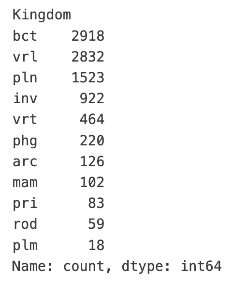

  First, I converted the abbreviations into full names. Second, I improved the class balance by filtering the data down to four main groups: bacteria, viruses, plants, and animals. The 'Animal' class was created by merging five subsets (Invertebrates, Vertebrates, Mammals, Rodents, and Primates).

  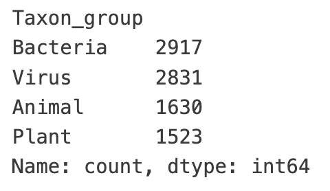

  **After receiving the feedback, I also performed the kNN analysis using the original, more granular classification (excluding only the tiny 'Plasmid' class).

  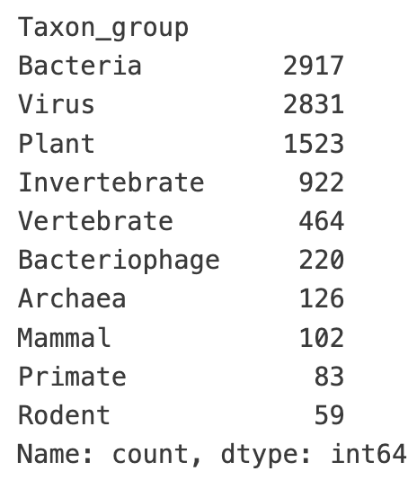

+ After preprocessing, the final sample sizes were 8901 for the 4-group data and 9247 for the 10-group dataset.

##### 5. Put data in standard format if necessary and justify if not applicable

The raw dataset is in CSV format.  

The preprocessed dataset is saved as another CSV file `preprocessed.csv` as well. 

### Analysis

##### 1. Appropriateness of summary statistics (if used) and reflection on dataset characteristics

Summary statistics 

1. Codon frequency statistics

   First few columns of the result: 

   ```python
                  UUA          UUG          CUU          CUC          CUA  \
   count  8903.000000  8903.000000  8903.000000  8903.000000  8903.000000   
   mean      0.013587     0.015570     0.014356     0.016002     0.007773   
   std       0.013522     0.007609     0.007183     0.010717     0.004992   
   min       0.000000     0.000000     0.000000     0.000000     0.000000   
   25%       0.003240     0.010335     0.009385     0.008365     0.003925   
   50%       0.009830     0.015000     0.013710     0.013880     0.007520   
   75%       0.019020     0.020050     0.018675     0.021610     0.010820   
   max       0.090440     0.061860     0.051680     0.096460     0.035180   
   ```

2. Statistics by taxonomic group

   ```python
   Animal:
     Number of samples: 1630
     Mean codon frequency: 0.0154
     Mean codon std: 0.0081
   
   Bacteria:
     Number of samples: 2918
     Mean codon frequency: 0.0155
     Mean codon std: 0.0101
   
   Plant:
     Number of samples: 1523
     Mean codon frequency: 0.0155
     Mean codon std: 0.0079
   
   Virus:
     Number of samples: 2832
     Mean codon frequency: 0.0154
     Mean codon std: 0.0070
   ```

Reflection on dataset characteristics

+ The summary statistics reflect some characteristics of the dataset. 

  According to the codon frequency statistics, all frequency values fall within a valid range, with the maximum value of 0.2754 and no anomalous outliers. 

  The mean codon frequency is nearly identical across all kingdoms. The mean codon standard deviation for bacteria is notably larger than others, indicating that the bacterial kingdom contains a wider spectrum of genetic coding styles.

+ How they do not reflect the dataset characteristics.

  While summary statistics confirm the data is valid, they fail to capture the distinct codon usage patterns of each taxon, because the mean values blur the differences between groups and ignore the relationships between the 64 codons.

##### 2. Discuss the analyses you chose to run

1. Principal Component Analysis (PCA) 

   Motivation: to reduce the 64 feature dimensions down, enabling a visual test of whether distinct taxonomic groups naturally separate into identifiable clusters.

   Result: 

   + 2D space

     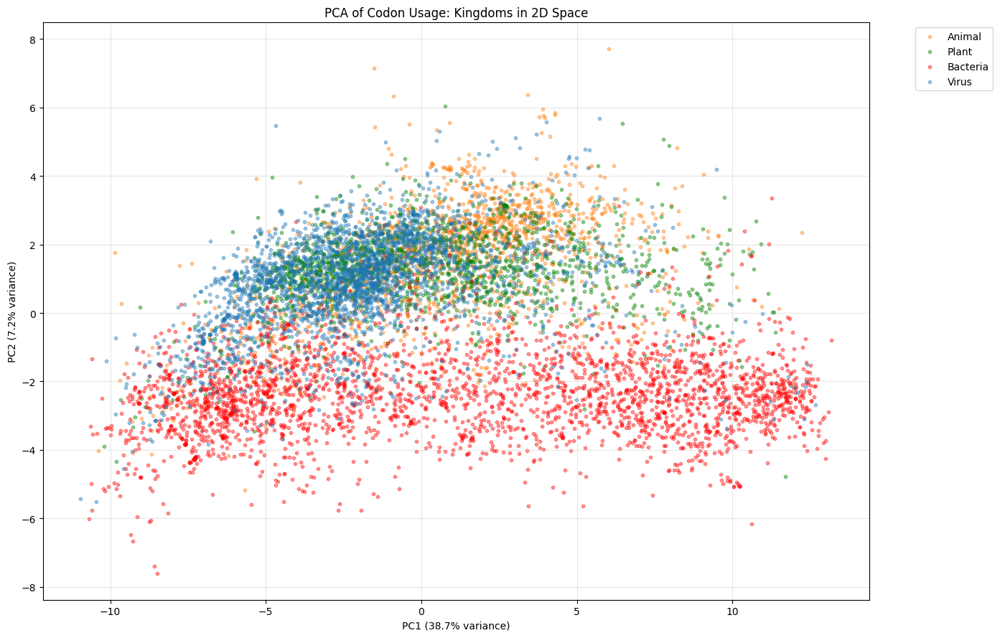

   + 3D space

     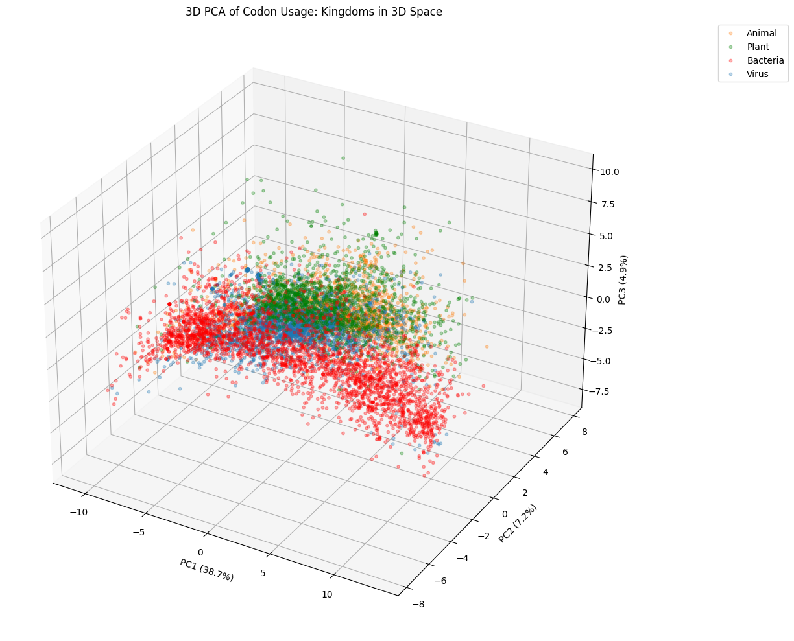

   + Variance explained v.s. PC number

     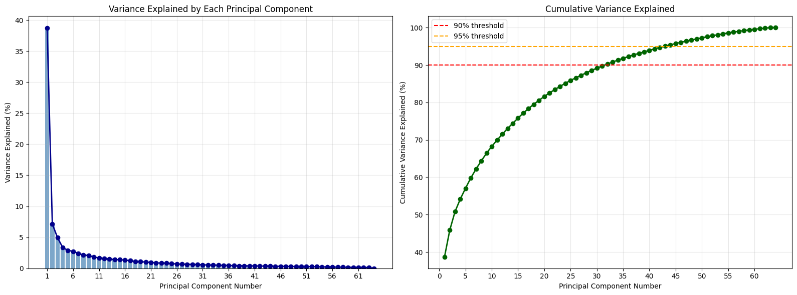

   Expectations vs. Observations: Discuss and explain results and whether they aligned with initial hypotheses

   + Expectation: Four taxonomic groups would occupy distinct regions of the PC space. Bacteria would exhibit the widest distribution reflecting their immense evolutionary diversity.
   + Observation: While each taxonomic group exhibits distinct clustering behavior, significant overlap is observed between the virus, animal, and plant categories. In contrast, bacteria display a much broader, diffuse distribution compared to the other groups, aligning with the initial hypothesis.
   + The wide spread of bacteria indicates a high level of genetic diversity within this taxonomic group. Additionally, its separation from the other clusters suggests a distinct peculiarity in bacterial codon usage patterns compared to others.
   + The significant overlap between virus, animal, and plant clusters suggests that evolutionary boundaries are not always distinct. Notably, the viral distribution spans across the animal and plant regions, illustrating the biological phenomenon of codon adaptation. Research[^1] confirms that because viruses rely on host tRNA pools for protein synthesis, they are under strong evolutionary pressure to mimic the codon preferences of their hosts to maximize replication speed.

2. k-Nearest Neighbors (kNN) classification

   Motivation: to determine whether taxonomic groups could be accurately predicted using k-Nearest Neighbors (kNN) based solely on codon usage frequency data.

   Results

   + The train-test split

     To ensure the model generalizes to new organisms rather than simply memorizing specific strains, I investigate the potential for data leakage. Here are the top value counts of `SpeciesName`:

     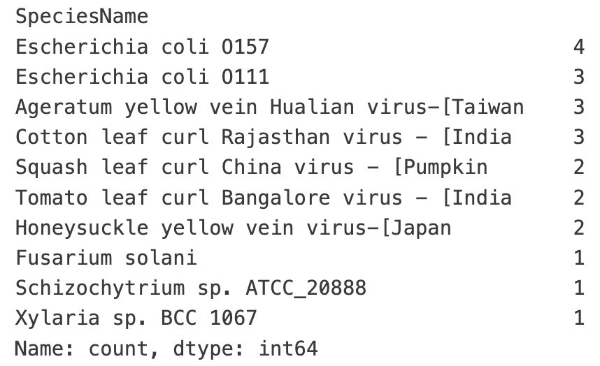

     Upon finding that duplicates are present (though rare), I implement a group-based split. This strategy ensures that all instances of a specific species go together into either the training set (75%) or the test set (25%).

     ```python
     from sklearn.model_selection import GroupShuffleSplit
     
     groups = df['SpeciesName'].values
     gss = GroupShuffleSplit(n_splits=1, test_size=0.25, random_state=42)
     train_idx, test_idx = next(gss.split(X_raw, y_enc, groups=groups))
     
     X_train, X_test = X_raw[train_idx], X_raw[test_idx]
     y_train, y_test = y_enc[train_idx], y_enc[test_idx]
     ```

   + Hyperparameter optimization

     To optimize the classification performance, I implement a systematic grid search to tune two hyperparameters: the number of neighbors ($k$) and the dimensionality of the feature space ($n$). This optimization process is executed independently for both the balanced '4-Group' model and the granular '10-Group' model.

     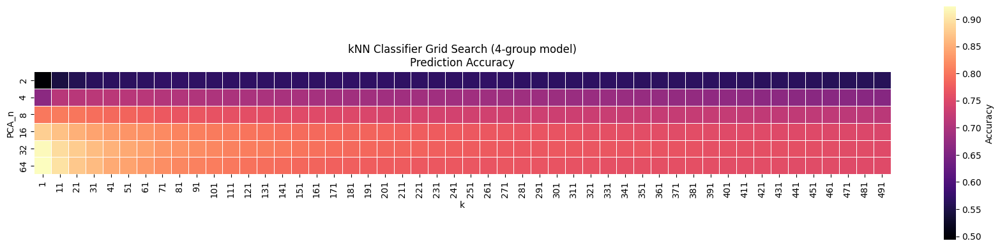

     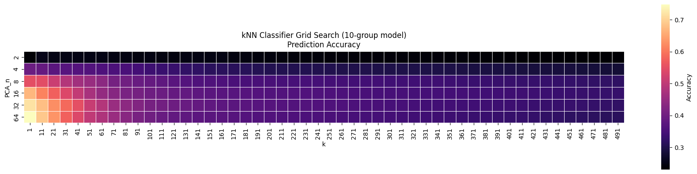

     The grid search reveals that the optimal hyperparameters for both the 4-group and 10-group models are k=1 (single nearest neighbor) and n=64 (full dimensionality). These two results are both out of my original expectation. 

     The success of k=1 indicates that the 'genomic fingerprint' is extremely precise. An organism's taxonomic identity is best predicted by its single closest match in the vector space, suggesting that codon usage patterns are evolutionarily conserved and distinct.

     The fact that the model prefers the full 64-dimensional space over PCA-reduced features suggests that biological signal is distributed across all codons. Dimensionality reduction likely discards subtle but critical variations necessary for distinguishing closely related taxa.

   + Performance of optimal models (k=1, n=64)

     4-group model

     + Test accuracy: 0.948

     + Test balanced_accuracy: 0.940

     + Confusion matrix

       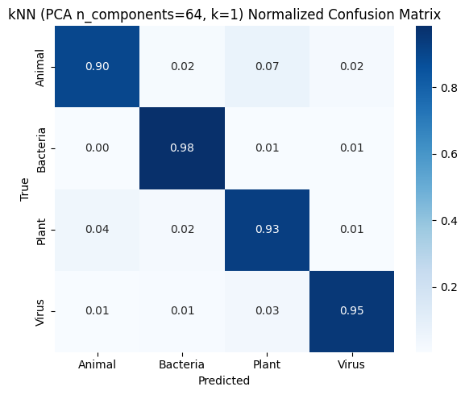

     10-group model

     + Test accuracy: 0.916 

     + Test balanced_accuracy: 0.766 

     + Confusion matrix

       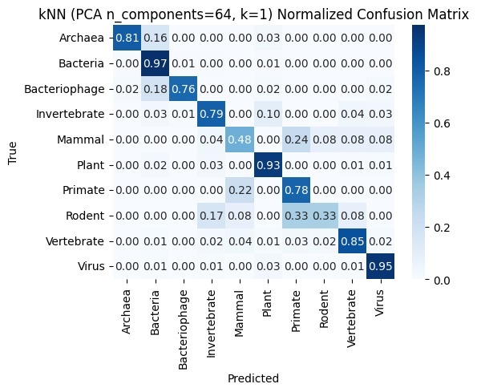

     Discussion

     + For the 4-group model, the diagonal values are consistently high, which confirms that bacteria, viruses, plants, and animals have distinct, recognizable codon usage signatures. 
       The only notable confusion occurs between animals and plants. This is biologically expected, as both are eukaryotes. They share a more recent common ancestor compared to bacteria or viruses.

     + The larger errors in the 10-group model reveal more biological relationships. The model misclassifies rodents as primates, invertebrates, and misclassifies mammals as primates, rodents and vertebrates. These groups are phylogenetically too close, making it statistically impossible for the model to separate them cleanly. 

       Also, bacteriophages are correctly identified 76% of the time, but 18% of the time they are misclassified as bacteria. This supports the host adaptation theory. These viruses have evolved to mimic their bacterial hosts so closely that the model sometimes cannot tell the difference between the virus and the bacterium it infects.

### Web backend and frontend

##### 1. Describe your server API (data retrieval aspect, returning JSON or XML or similar; not webpages) (?/5 points)

The related code of API:

```python
@app.route('/api/predict', methods=['GET'])
def api_predict():
    """
    Example: /api/predict?k=5&pca_n=30
    """
    k = int(request.args.get('k', 5))
    pca_n = int(request.args.get('pca_n', 64))
    results = compute_knn_results(k, pca_n)
    
    return jsonify(results)
```

The backend exposes a RESTful API designed to serve structured data in JSON format rather than static HTML. The primary endpoint accepts model hyperparameters (specifically the number of neighbors k and PCA dimensions n) as inputs. 

The API returns a JSON object containing a comprehensive classification performance report, which includes:

+ Global Metrics: Overall `accuracy` and `balanced_accuracy`.
+ Confusion Matrix `cm`
+ Class-Level Details: A nested dictionary providing `precision`, `recall`, `f1-score`, and `support` for each specific taxonomic group (Bacteria, Virus, Animal, Plant), alongside their macro and weighted averages."

e.g. 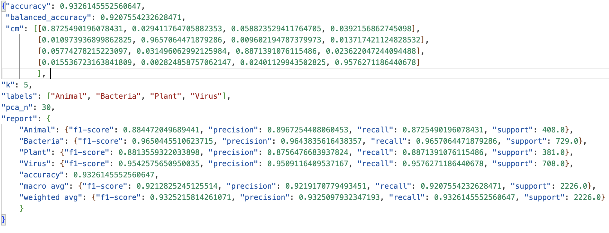

The API endpoints are accessible via HTTP GET requests using query parameters. For example, a request to `/api/predict?k=100&pca_n=64` allows the client to dynamically specify the number of neighbors and PCA components for the prediction model. 

 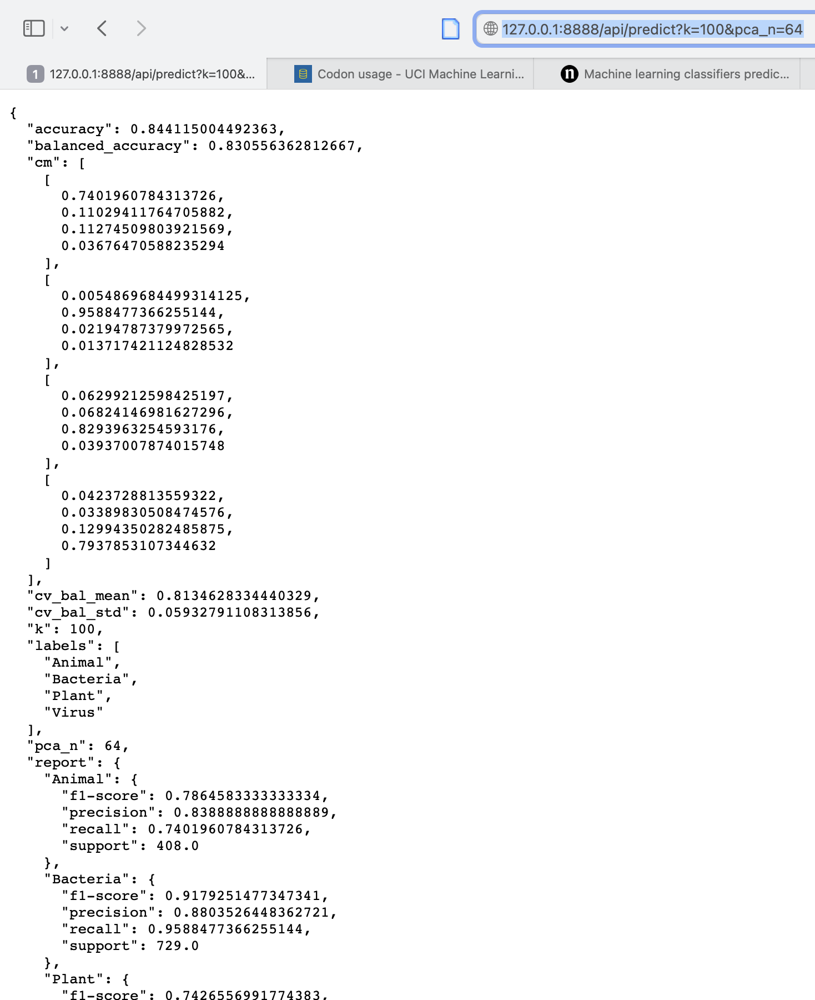

Alternatively, the JSON response can be retrieved programmatically using the provided helper script,  [get_prediction.py](get_prediction.py). This script automates the request and saves the classification report locally.

##### 2. Describe the web front-end (?/5 points)

The index page shows the PCA result of the 4 taxonomic groups in 2D space. 

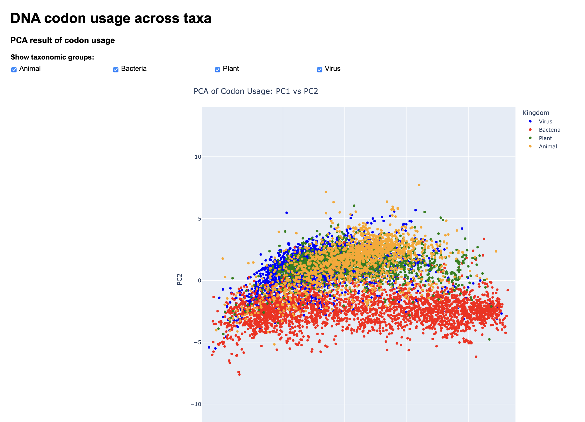

I implemented explicit checkboxes that allow users to toggle specific taxonomic groups on or off. While Plotly natively supports filtering via the legend, these checkboxes are quite redundant but maybe helpful to users who are not familiar with Plotly like me.

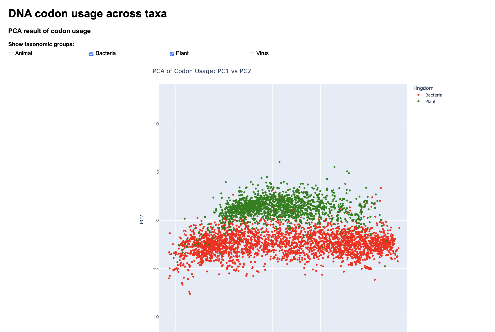

At the end of the index page, there's a link that routes users to the kNN prediction page.

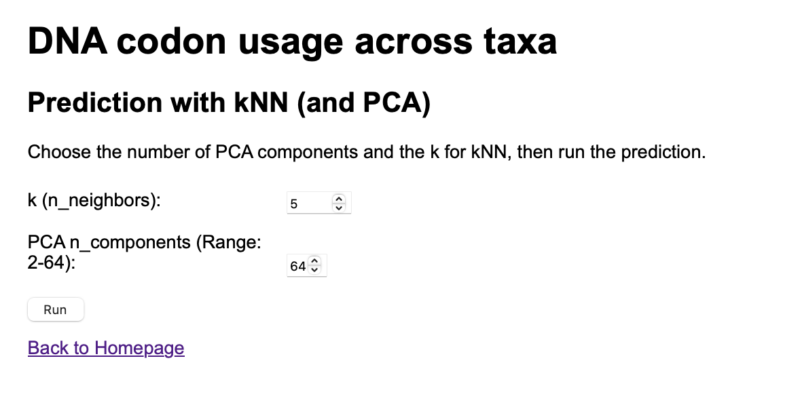

On this interface, user can configure model hyperparameters k and the dimensionality of the feature space n. Input values falling outside the trained range immediately trigger an alert, preventing invalid API requests.

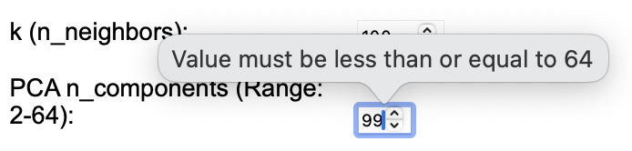

Upon submission of valid hyperparameters, it takes users to the result page that displays a performance report for the generated model. This page also allows users to cycle back to the kNN dashboard to run a new experiment or return to the homepage.


### Paper and presentation

##### Feedback Integration (?/5 points)

Based on the feedback from my professor and peer, I expanded the analysis to include the original 10-group dataset, which revealed interesting relationships among the different groups. I also corrected the misuse of the term 'Kingdom'.

##### Citations

[^1]: Chen, F., Wu, P., Deng, S., Zhang, H., Hou, Y., Hu, Z., Zhang, J., Chen, X., & Yang, J. R. (2020). Dissimilation of synonymous codon usage bias in virus-host coevolution due to translational selection. *Nature ecology & evolution*, *4*(4), 589–600. 