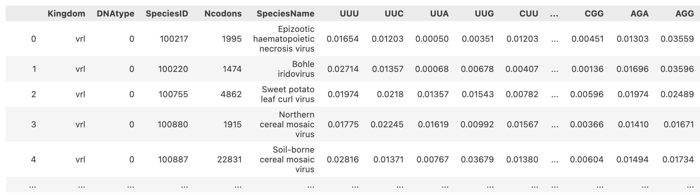
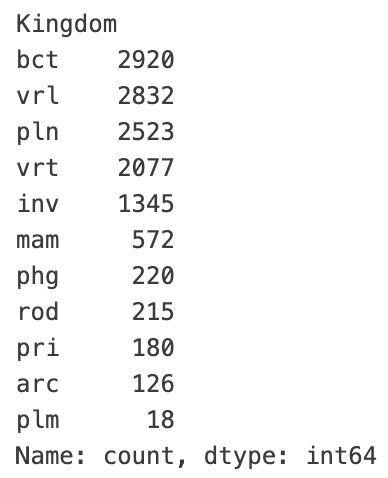
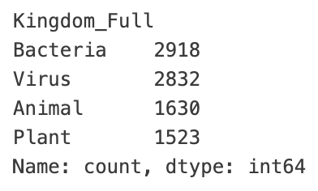

# DNA codon usage across taxa

*Jinnie Sun js4872*

### Getting started

##### 1. Describe dataset and why it is interesting

This dataset consists of DNA codon usage frequencies for a diverse collection of biological organisms, ranging from bacteria and viruses to mammals and plants. There are 69 columns total. The primary features are the 64 columns representing the normalized frequency of each distinct genetic codon. 

We can use this data to measure the diversity of DNA patterns across nature. This is interesting because we can test if codon usage acts like a unique fingerprint. If it does, we should be able to predict which family an organism belongs to simply by analyzing its codon statistics.

##### 2. Explain how acquired it; if public give URL or other way to get it

The dataset can be downloaded through this url: https://archive.ics.uci.edu/static/public/577/codon+usage.zip.

This dataset is licensed under a [Creative Commons Attribution 4.0 International](https://creativecommons.org/licenses/by/4.0/legalcode) (CC BY 4.0) license.

Citation: Hallee, L., Khomtchouk, B.B. Machine learning classifiers predict key genomic and evolutionary traits across the kingdoms of life. Sci Rep 13, 2088 (2023). https://doi.org/10.1038/s41598-023-28965-7

##### 3. Discuss FAIRness

Findable

+ The dataset is indexed in a reputable repository (UCI Machine Learning repository) with rich metadata, making it highly searchable.

Accessible

+ Data is publicly retrievable without any authentication.

Interoperable

+ It uses the universally compatible CSV format.

Reusable

+ There is a detailed description of how it was derived from the CUTG database.
+ However, it is a static dataset that does not automatically update as new genomic sequences are discovered.

##### 4. Describe data cleaning or preprocessing

The head columns of the dataset:

+ `Kingdom`

  The raw dataset contained 11 unevenly distributed `Kingdom` categories labeled with three-letter codes (e.g. 'bct' for Bacteria).

  

  First, I converted the abbreviations into full names. Second, I improved the class balance by filtering the data down to four main groups: Bacteria, Viruses, Plants, and Animals. The 'Animal' class was created by merging five subsets (Invertebrates, Vertebrates, Mammals, Rodents, and Primates).

  

+ `DNAtype`

  The `DNAtype` is denoted as an integer for the genomic composition in the species (e.g. 0-genomic, 1-mitochondrial, ...). Since this project focuses on the core genome, I restricted the dataset to include only entries labeled as Type 0.

+ No missing values in this dataset. 

+ After preprocessing, the final dataset consists of 8903 entries.

##### 5. Put data in standard format if necessary and justify if not applicable

The raw dataset is in CSV format.  

The preprocessed dataset is saved as another CSV file `preprocessed.csv` as well. 